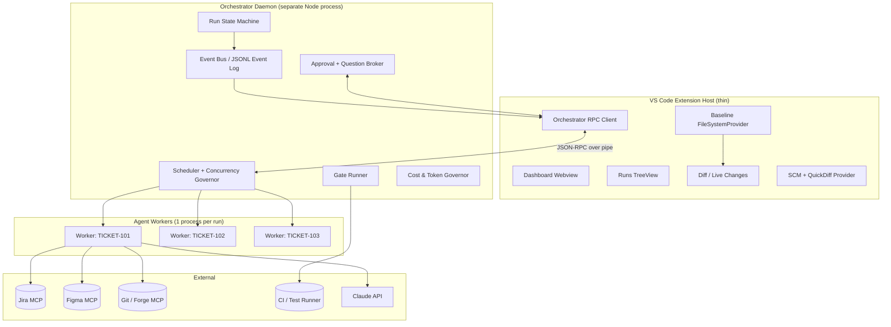
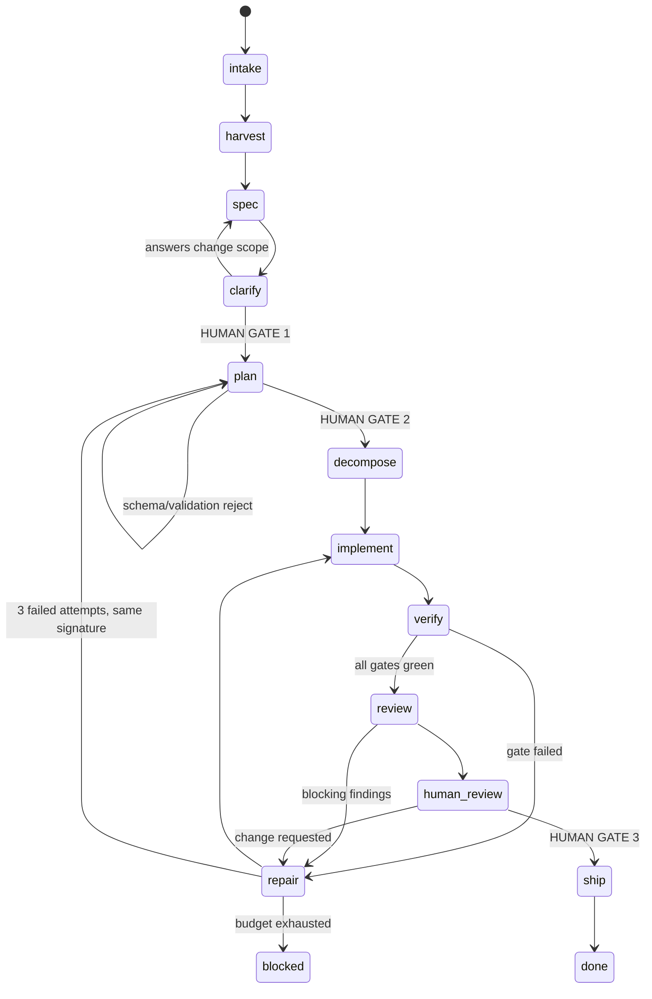

# AgentFlow — A Multi-Agent Ticket-to-PR Workflow Extension for VS Code

**Architecture and implementation plan**
Target runtime: VS Code extension (standalone, no dependency on other AI extensions)
Primary model provider: Claude, via `@anthropic-ai/claude-agent-sdk`
Version: 1.0 draft

---

## 1. Scope

### 1.1 What this system does

A ticket goes in. A reviewed, tested, green pull request comes out — with a human approving at three defined points and able to interrupt at any point.

```
Jira ticket ──▶ Context Harvest ──▶ Spec ──▶ [Q&A gate] ──▶ Plan ──▶ [Plan gate]
      ──▶ Task graph ──▶ Implement ⇄ Verify (bounded repair loop)
      ──▶ Automated review ──▶ [Diff gate] ──▶ Commit ▸ Push ▸ PR ▸ Jira transition
```

Several tickets run this pipeline at the same time, each in its own git worktree, each streaming live progress into one dashboard.

### 1.2 Goals

| # | Goal | How it is measured |
|---|---|---|
| G1 | Jira ticket → PR with no manual context assembly | Time from "start" to "PR open" |
| G2 | Human approves *decisions*, not keystrokes | ≤ 3 mandatory gates per ticket; ≤ 5 clarifying questions per phase |
| G3 | Correctness is machine-verified, never model-asserted | 100% of "done" transitions backed by a command exit code |
| G4 | N tickets in parallel with visible live state | 4+ concurrent runs on a 16 GB dev machine |
| G5 | Everything is resumable and auditable | Kill the window mid-run; resume with no loss of decisions |
| G6 | Reversible by construction | One command restores the repo to any checkpoint |

### 1.3 Non-goals (v1)

- Not a chat IDE. Free-form chat exists only as a side channel on a run.
- Not autonomous merge. A human merges.
- Not multi-repo per ticket (single repo per run; cross-repo is v2).
- Not a hosted service. Local-first; a remote executor is a v2 seam, designed for but not built.
- Not model-agnostic in v1. Claude first; the provider seam exists (§17.3) but only one implementation ships.

### 1.4 The one non-negotiable invariant

> **The model proposes; the runner decides.**
> No phase advances because an agent said it was finished. A phase advances because a *gate* — a deterministic command, a schema validation, or a human click — returned success. Model output is evidence, never verdict.

Every design choice below follows from this.

---

## 2. System overview

### 2.1 Component map



### 2.2 The three-tier rule

| Tier | Runs where | Owns | Never does |
|---|---|---|---|
| **Extension host** | VS Code process | Rendering, user intent capture, editor integration | Model calls, test execution, long loops |
| **Orchestrator** | Child Node process, one per workspace | Scheduling, state machine, gates, persistence, approvals | Touch the VS Code API |
| **Worker** | Child process per active run | One agent session, one worktree | Talk to the UI directly, mutate shared state |

Rationale: the extension host is single-threaded and shared with every other extension. A blocked event loop freezes the editor. A crashed agent must not take down the window, and a window reload must not kill a 40-minute run. This separation is the single highest-value structural decision in the design; everything about resumability and parallelism depends on it.

The orchestrator is spawned lazily on first use, holds a lockfile at `.agentflow/orchestrator.lock`, and survives extension reloads. On activation, the extension attempts to attach to an existing daemon before spawning.

### 2.3 Transport

`vscode` ⇄ `orchestrator`: JSON-RPC 2.0 over a named pipe (Windows) / unix domain socket (macOS, Linux), framed with `Content-Length` headers (reuse `vscode-jsonrpc`).

`orchestrator` ⇄ `worker`: Node `child_process.fork` IPC with a typed message envelope. Workers are cheap to kill and are treated as disposable.

All UI updates are **push**. The extension subscribes to an event stream and never polls.

---

## 3. Domain model

### 3.1 Entities

```typescript
type RunId = string;          // uuid
type TicketKey = string;      // "PAY-1423"

interface Run {
  id: RunId;
  ticket: TicketRef;
  repo: RepoRef;
  worktree: WorktreePath;
  branch: string;
  phase: Phase;
  status: RunStatus;
  attemptBudget: AttemptBudget;
  cost: CostLedger;
  createdAt: number;
  artifacts: Record<ArtifactKind, ArtifactRef>;
  sessions: Record<Phase, ClaudeSessionRef>;   // for resume / fork
}

type Phase =
  | 'intake' | 'harvest' | 'spec' | 'clarify' | 'plan'
  | 'decompose' | 'implement' | 'verify' | 'repair'
  | 'review' | 'human_review' | 'ship' | 'done';

type RunStatus =
  | 'queued' | 'running'
  | 'waiting_human'         // blocked on a gate or a question
  | 'blocked'               // external failure: auth, CI down, merge conflict
  | 'failed' | 'cancelled' | 'succeeded';

interface ArtifactRef {
  kind: ArtifactKind;        // 'spec' | 'plan' | 'taskgraph' | 'review' | 'testreport' | 'diff'
  version: number;           // artifacts are versioned, never overwritten
  path: string;              // .agentflow/runs/<id>/artifacts/plan.v3.json
  approvedBy?: string;
  approvedAt?: number;
  schemaVersion: string;
}
```

### 3.2 Task graph

The plan compiles to a DAG, not a list. This is what makes parallel sub-work and precise retry possible.

```typescript
interface Task {
  id: string;                     // "T3"
  title: string;
  intent: string;                 // what changes and why
  files: string[];                // predicted touch set (advisory, checked later)
  dependsOn: string[];            // DAG edges
  acceptance: AcceptanceCriterion[];
  verification: GateSpec[];       // which gates must pass for THIS task
  risk: 'low' | 'medium' | 'high';
  estimatedEdits: number;
  status: 'pending' | 'active' | 'verifying' | 'repairing' | 'done' | 'abandoned';
  attempts: Attempt[];
}

interface AcceptanceCriterion {
  id: string;
  statement: string;              // human-readable
  check: GateSpec | 'manual';     // MUST be machine-checkable unless explicitly manual
}
```

Rule enforced at plan-validation time: **every task must carry at least one non-`manual` acceptance check**, or the plan is rejected back to the planner with the specific task ID. This is what stops the classic failure where the agent writes plausible code and declares victory.

### 3.3 State is an event log

Each run owns an append-only JSONL log: `.agentflow/runs/<runId>/events.jsonl`.

```typescript
type RunEvent =
  | { t: 'phase_entered'; phase: Phase; at: number }
  | { t: 'artifact_written'; kind: ArtifactKind; version: number }
  | { t: 'question_asked'; question: Question }
  | { t: 'question_answered'; questionId: string; answer: Answer }
  | { t: 'approval_requested'; gate: GateId; artifact: ArtifactRef }
  | { t: 'approval_decided'; gate: GateId; decision: 'approve'|'reject'|'revise'; note?: string }
  | { t: 'tool_call'; tool: string; input: unknown; toolUseId: string }
  | { t: 'tool_result'; toolUseId: string; ok: boolean; summaryLine: string }
  | { t: 'file_changed'; path: string; op: 'create'|'modify'|'delete'; hunks: number }
  | { t: 'checkpoint'; label: string; commitSha?: string; messageUuid?: string }
  | { t: 'gate_result'; gate: GateId; ok: boolean; durationMs: number; report: GateReport }
  | { t: 'cost'; usd: number; inputTokens: number; outputTokens: number; model: string }
  | { t: 'error'; scope: string; message: string; retryable: boolean };
```

The UI state, the audit trail, the resume logic, and the post-hoc evals are all derived from this one log. A periodic snapshot (`state.json`) exists purely as a read optimization and can be rebuilt by replay at any time.

---

## 4. Process and isolation model

### 4.1 One worktree per run

```
repo/                              # user's checkout, never touched by agents
  .agentflow/
    config.json
    orchestrator.lock
    runs/<runId>/{events.jsonl,state.json,artifacts/,logs/}
    worktrees/PAY-1423/            # git worktree, branch agentflow/PAY-1423
    worktrees/PAY-1451/
```

`git worktree add .agentflow/worktrees/PAY-1423 -b agentflow/PAY-1423 origin/main`

Why real worktrees rather than an in-memory or shadow filesystem:

- Builds and tests are real. Gradle, node, compilers, and language servers all need a real tree. A virtual FS would force you to materialize before every gate anyway.
- Isolation is free and total. Two agents cannot collide, and neither can touch the user's dirty working copy.
- Rollback is `git reset`/`git checkout`, not custom bookkeeping.
- Cleanup is `git worktree remove`.

Cost: disk (mitigate with `--reference` or a shared object store; worktrees already share `.git/objects`) and cold build caches per tree (mitigate by pointing `GRADLE_USER_HOME` / build caches at a shared directory — see §12.6).

### 4.2 Worker lifecycle

```
spawn ─▶ attach worktree ─▶ warm SDK subprocess (startup())
      ─▶ run phase ─▶ emit events ─▶ persist session id
      ─▶ idle (kept warm N minutes) ─▶ exit
```

The Agent SDK's `startup()` pre-warms the CLI subprocess and completes the initialize handshake before a prompt exists, so the first real query does not pay spawn cost inline. The pool keeps one warm process per active run plus one spare.

### 4.3 Concurrency governor

Parallelism is bounded by the *scarcest* resource, not by a single number:

```typescript
interface ConcurrencyLimits {
  maxActiveRuns: number;          // default 4
  maxConcurrentGateJobs: number;  // default 2  — tests are CPU/memory hogs
  maxConcurrentModelCalls: number;// default 6  — respects API rate limits
  maxWorktrees: number;           // default 8  — disk guard
}
```

Gate execution (compilation, test suites) goes through a **separate semaphore** from model calls. In practice this is what makes 4 parallel tickets usable: four agents can think at once, but only two can run a Gradle build at once. Without this split, the machine thrashes and every run gets slower than it would have been serially.

Runs also carry a priority and are preemptible in `waiting_human` state — a run blocked on a human question releases its gate slot immediately.

---

## 5. The pipeline

Each stage has: **entry criteria → agent role → inputs → output artifact → gate → exit criteria**. A stage never advances on model assertion.



### Stage 0 — Intake

**Trigger:** user picks a ticket from the Jira panel, pastes a key, or a watcher sees a transition to "Ready for Dev" on a filtered board.

**Work:**
1. Fetch issue: summary, description, ACs, comments, attachments, labels, components, linked issues, parent epic.
2. Extract design links (`figma.com/file/...`, `figma.com/design/...`) from description, comments, and attachments.
3. Normalize into a `TicketRef` with provenance for every field (which comment, which author, what timestamp).
4. Classify: `feature | bug | refactor | chore | spike`. This selects the pipeline profile (§5.10).

**Gate (deterministic, no model):** `INTAKE_COMPLETE` — issue exists, is assignable, repo mapping resolved, base branch resolvable. Missing ACs is a *warning*, not a blocker — the clarify stage exists for that.

**Model:** Haiku-tier for classification and de-duplication of comment noise. Cheap, high volume.

### Stage 1 — Context Harvest

The most under-invested stage in most agentic tools, and the one that determines whether the plan is any good.

**Work (parallel subagents, read-only permission mode):**

| Subagent | Produces |
|---|---|
| `repo-cartographer` | Module map, build graph, entry points, where this feature type lives, existing patterns for the same concern |
| `history-archaeologist` | `git log`/`blame` on candidate files; prior related PRs; who owns this code; past reverts in this area |
| `design-reader` | Figma frames → component inventory, tokens, states, redlines, deltas vs existing implementation |
| `contract-reader` | API schemas, protobuf/OpenAPI, DTOs, feature flags, config keys touched |
| `test-cartographer` | Existing test layout, fixtures, helpers, naming conventions, what "a good test here" looks like |

Each returns a bounded, structured summary — never raw dumps. Enforce with `outputFormat: { type: 'json_schema', schema: ... }` so the return value is parseable rather than prose.

**Why subagents rather than one big session:** context economy. Five explorations of 30k tokens each would blow the main context; five subagents each return a 1–2k structured digest into a parent session that stays lean. The parent never sees the raw exploration.

**Gate:** `HARVEST_SUFFICIENT` — every subagent returned schema-valid output; the touch-set prediction is non-empty; at least one existing similar implementation was located, or the agent explicitly recorded "greenfield, no precedent."

**Output artifact:** `context.v1.json`.

### Stage 2 — Spec

**Role:** Analyst (Opus-tier, extended thinking on).

**Input:** ticket + `context.v1.json`. **No repo write access. Read-only permission mode.**

**Output:** `spec.vN.json`

```jsonc
{
  "problem": "…",
  "inScope": ["…"],
  "outOfScope": ["…"],
  "acceptanceCriteria": [
    { "id": "AC1", "statement": "…", "source": "jira:comment:88231", "checkable": true }
  ],
  "affectedSurfaces": { "modules": [], "apis": [], "screens": [], "flags": [] },
  "designReferences": [{ "figmaNode": "12:345", "frame": "Checkout / Empty state" }],
  "assumptions": [{ "id": "A1", "statement": "…", "confidence": 0.6, "impactIfWrong": "high" }],
  "openQuestions": [ /* Question objects, see §7.2 */ ],
  "nonFunctional": { "perf": "…", "security": "…", "accessibility": "…", "telemetry": "…" },
  "rollback": "…"
}
```

**Gate:** `SPEC_VALID` — schema-valid; every AC traces to a ticket field, comment, or design node (no invented requirements); every high-impact assumption has a corresponding open question.

The provenance requirement matters more than it looks. Requiring `source` on each AC is the cheapest available defence against hallucinated scope, because the model cannot fill the field without pointing at something real.

### Stage 3 — Clarify — **HUMAN GATE 1**

Questions are batched, not drip-fed. See §7.2 for the full protocol.

**Exit:** all `blocking: true` questions answered or explicitly deferred with a recorded default. Answers are appended to the spec as a new version (`spec.v2.json`) with an `answers` block; the spec is never edited in place.

If answers change scope materially (an agent-run diff of `inScope`/`outOfScope`), the pipeline loops back to Stage 2 for one re-spec. Loop limit: 2.

### Stage 4 — Plan — **HUMAN GATE 2**

**Role:** Planner (Opus-tier). Read-only. Sees spec + context, **not** the harvest raw material.

**Output:** `plan.vN.json` — the task DAG from §3.2, plus:

```jsonc
{
  "strategy": "…prose, max 200 words…",
  "tasks": [ /* Task[] */ ],
  "sequencing": "…why this order…",
  "testStrategy": {
    "newTests": [{ "task": "T2", "file": "…", "cases": ["…"] }],
    "reproTest": { "required": true, "task": "T1" },   // bugs: failing test first
    "regressionRisk": ["…"]
  },
  "migrations": [],
  "featureFlag": { "required": true, "key": "checkout_empty_state_v2" },
  "rollbackPlan": "…",
  "outOfPlanPolicy": "ask"        // 'ask' | 'allow_minor' | 'block'
}
```

**Machine gate `PLAN_VALID`** (runs before a human ever sees it — do not waste human attention on a malformed plan):

1. Schema-valid.
2. DAG is acyclic; no orphan tasks.
3. Every task has ≥1 machine-checkable acceptance criterion.
4. Every spec AC maps to ≥1 task (coverage check, both directions).
5. Predicted touch set exists on disk (or is a plausible new path under an existing module).
6. Bug-class tickets contain a reproduction-test task ordered first.
7. Estimated total edits under the ticket's budget; otherwise the plan must propose a split.

Failures return to the planner with the exact rule ID and offending element, up to 3 attempts, then escalate to the human with the validation report attached.

**Human gate:** the plan renders as an interactive review — approve, approve-with-edits (the human can delete/reorder/rewrite tasks directly), request revision with a comment, or reject. Edits produce `plan.v(N+1)` marked `editedBy: human`, and the diff between versions is preserved.

### Stage 5 — Decompose

Mechanical, no model: compile the approved plan into **work packets**. One packet per task, each self-contained:

```typescript
interface WorkPacket {
  task: Task;
  contextSlice: {
    files: string[];              // read-first list
    specExcerpt: string;          // only the ACs this task serves
    conventions: string[];        // from test-cartographer & repo-cartographer
    designNodes?: FigmaNodeRef[];
  };
  gates: GateSpec[];
  guardrails: {
    allowedPaths: string[];       // glob allowlist → enforced in PreToolUse hook
    forbiddenPaths: string[];     // e.g. **/build.gradle.kts, **/*.pem, .github/**
    maxFilesTouched: number;
    maxNewDeps: 0 | number;       // adding a dependency requires human approval
  };
}
```

The guardrails are the concrete, enforceable version of "stay in scope." They are enforced by code (§7.4), not by prompt instruction.

### Stage 6 — Implement

**Role:** Implementer (Sonnet-tier, `permissionMode: 'acceptEdits'` scoped to the worktree, `enableFileCheckpointing: true`).

Per task, in DAG order (independent tasks may run concurrently if `maxConcurrentModelCalls` allows and their `allowedPaths` are disjoint — path-disjointness is checked before parallel dispatch):

1. Checkpoint: record the SDK message UUID and `git stash create` sha as a rewind point.
2. Feed the work packet. The implementer reads its `contextSlice` first, then edits.
3. Every `Write`/`Edit` passes through the `PreToolUse` hook: path allowlist, secret-pattern scan, generated-file guard, file-size sanity.
4. Every tool result streams to the UI as a `file_changed` event with a hunk count.
5. On task completion the implementer must emit a structured result (`outputFormat` json_schema): what changed, why, which ACs it believes are now satisfied, what it deliberately did not do.

Commit policy: one commit per completed-and-verified task, message `[<TICKET>] <task.title>` with a trailer block recording the run ID, task ID, and attempt number. Commits happen **after** the task's gates pass, never before — the history stays bisectable.

### Stage 7 — Verify

Deterministic. No model in the decision path. See §12 for the full gate ladder. The verifier runs the task's `gates` in cost order (fastest first, fail fast) and produces a `GateReport`:

```typescript
interface GateReport {
  gate: GateId;
  ok: boolean;
  exitCode: number;
  durationMs: number;
  failures: Failure[];        // parsed, structured — not raw log text
  raw: string;                // path to the full log on disk, not inlined
  signature: string;          // hash of normalized failure set — see §9
}
```

**Parsing failures into structure is essential.** Feeding 4,000 lines of Gradle output back to the model burns context and buries the signal. Each gate adapter ships a parser that yields `{file, line, rule, message}` tuples; the model receives at most the top 20, plus counts.

### Stage 8 — Repair loop (the correctness engine)

This is §9. It is the part of the design that most determines whether the tool is trustworthy, so it gets its own section.

### Stage 9 — Automated review

**Role:** Reviewer (Opus-tier), in a **fresh session with no implementer context**. It sees: the spec, the approved plan, the full diff, and the gate reports. It does not see the implementer's reasoning, its self-justification, or its intermediate attempts.

That isolation is deliberate. A reviewer that inherits the implementer's context inherits its blind spots and tends to ratify. A cold reviewer reading only the diff behaves like an actual reviewer.

Four review passes, each a separate subagent with a narrow brief:

| Pass | Looks for |
|---|---|
| `correctness` | Logic errors, edge cases, error paths, null/empty/boundary, concurrency |
| `conformance` | Diff vs plan (scope creep, missing tasks), house conventions, layering violations |
| `security` | Injection, secrets, authz gaps, unsafe deserialization, PII in logs, dependency risk |
| `maintainability` | Duplication, dead code, naming, test quality (does the test actually assert?) |

Output: `review.vN.json`

```jsonc
{
  "findings": [{
    "id": "F1", "severity": "blocker|major|minor|nit",
    "pass": "security", "file": "…", "line": 42,
    "claim": "…", "evidence": "…", "suggestedFix": "…",
    "confidence": 0.0
  }],
  "planConformance": { "unplannedFiles": [], "unimplementedTasks": [], "verdict": "pass|warn|fail" },
  "verdict": "approve | changes_required"
}
```

**Gate `REVIEW_CLEAR`:** zero unresolved `blocker`, zero unresolved `major`. Findings at those severities feed straight back into the repair loop as new tasks. `minor`/`nit` are surfaced to the human but do not block.

Anti-sycophancy measure: the reviewer's own output is scored. A review returning zero findings on a diff over ~150 changed lines triggers one automatic re-review with an adversarial framing before it is accepted. Reviews that pass diffs later rejected by the human are logged for eval (§16.3).

### Stage 10 — Human review — **HUMAN GATE 3**

The human sees a single review surface:

- Full diff in VS Code's native diff editor (multi-file, with the baseline provided by the FileSystemProvider in §11.2).
- Findings pinned as diagnostics on the relevant lines.
- Gate report summary: what ran, what passed, timings, coverage delta.
- Plan conformance: what was planned vs what changed, with unplanned files highlighted.
- Cost and duration.

Actions: **Approve → ship** · **Comment → repair loop** (inline comments become repair tasks, and the comment text is passed verbatim) · **Reject → abandon run, keep branch** · **Take over → open worktree in a window, agent stands down.**

### Stage 11 — Ship

1. Rebase or merge base branch; on conflict → `blocked`, notify human (auto-resolution is not attempted in v1; it is the highest-risk automation for the lowest payoff).
2. Re-run the full gate ladder post-rebase. Non-negotiable: the previously green result was on a different tree.
3. Push branch.
4. Open PR: title from ticket, body generated from spec + plan + gate summary + a "how to verify manually" section, linked to the ticket.
5. Transition the Jira issue, post a comment with the PR link and a plain-language summary.
6. Attach the run's audit bundle (event log, artifacts, gate reports) as a build artifact or a gist, depending on config.
7. Keep the worktree for a configurable TTL (default 7 days) so a human can pick it up, then GC.

### 5.10 Pipeline profiles

Not every ticket deserves all eleven stages. Profiles select which stages run and which gates are mandatory:

| Profile | Skips | Extra |
|---|---|---|
| `bug` | — | Mandatory reproduction test before fix; regression test required |
| `feature` | — | Full pipeline |
| `chore` | Clarify (unless questions are blocking), Figma harvest | — |
| `refactor` | Spec Q&A | Mandatory: behaviour-preservation gate (existing tests unchanged and green; no new public API) |
| `spike` | Implement, Ship | Produces a document and a throwaway branch only |

The profile is chosen at intake and can be overridden by the human at Gate 1.

---

## 6. Multi-agent topology

### 6.1 Roles

| Role | Model tier | Permission mode | Session strategy | Thinking |
|---|---|---|---|---|
| Triage | Haiku | read-only | ephemeral | off |
| Harvest subagents (×5) | Sonnet | read-only | subagents of one parent | low |
| Analyst (spec) | Opus | read-only | own session, resumable | high |
| Planner | Opus | read-only | forks the analyst session | high |
| Implementer | Sonnet | acceptEdits, scoped | one session per run, resumed per task | medium |
| Verifier | *none* | n/a | deterministic runner | n/a |
| Repair agent | Sonnet → Opus on escalation | acceptEdits, scoped | fork of implementer, or fresh on escalation | medium → high |
| Reviewer (×4 passes) | Opus parent + Sonnet passes | read-only | fresh session, cold | high |
| Summarizer | Haiku | none | ephemeral | off |

Model IDs are configuration, not code. Ship with a defaults file mapping tier → model string and validate at startup against `query().supportedModels()`, so a model rename never bricks the extension.

### 6.2 Subagent vs. new session — the decision rule

- **Subagent** (`options.agents`) when the work is a bounded exploration whose *conclusion* matters and whose *process* does not. The parent gets a digest; the tokens spent exploring never enter the parent's context. All five harvest explorers, and all four review passes, are subagents.
- **New top-level session** when the work needs a genuinely clean slate for epistemic reasons — the reviewer must not inherit the implementer's rationalizations.
- **Fork** (`resume` + `forkSession: true`) when you want shared history but divergent futures — e.g. Planner forking the Analyst session, or trying two repair strategies against the same failure and keeping the winner.
- **Resume** (`resume: sessionId`) for the implementer across tasks in one run: the accumulated understanding of the codebase is the asset.

### 6.3 Context discipline

The failure mode of long agentic runs is context rot: by turn 60 the model is reasoning over its own stale summaries. Countermeasures, in order of effectiveness:

1. **Artifacts, not conversation.** Each phase's output is a file. The next phase reads the file. Phases do not inherit chat history except where §6.2 says so.
2. **Digest-returning subagents.** Nothing raw crosses a phase boundary.
3. **Structured tool output.** `outputFormat: json_schema` on every phase whose result the orchestrator consumes.
4. **Parsed gate output.** Top-20 failures, never raw logs.
5. **Context watermark.** Poll `query().getContextUsage()`; at 60% of window, checkpoint and hand off to a fresh session seeded with the artifact set rather than letting compaction happen implicitly.
6. **Tool budget per phase** (`maxTurns`), so a stuck loop terminates rather than grinding.

### 6.4 Orchestration is code, not a model

There is no "orchestrator agent" deciding what happens next. Phase transitions, retries, escalations, and gate selection are ordinary TypeScript in the state machine. Models are called *inside* phases to do the phase's work.

This is a deliberate rejection of the fully-autonomous-orchestrator pattern. A deterministic controller is debuggable, testable, resumable, and auditable; a model controller is none of those, and buys flexibility this problem does not need — the pipeline is genuinely a fixed pipeline.

---

## 7. Human-in-the-loop protocol

### 7.1 Three mandatory gates, no more

| Gate | Question the human answers | Artifact |
|---|---|---|
| G1 Clarify | "Is my understanding right, and how do I resolve these ambiguities?" | spec + questions |
| G2 Plan | "Is this the right approach and decomposition?" | plan DAG |
| G3 Diff | "Is this code I would merge?" | diff + review + gates |

Everything else is either machine-decided or a *notification*. Approval fatigue destroys these tools faster than bad code does: if the human clicks "yes" thirty times per ticket, by ticket three they are clicking without reading, and the gates become theatre.

### 7.2 The question protocol

Agents may only ask via a single in-process MCP tool, `ask_human`, registered with `createSdkMcpServer`. Free-text questions in assistant prose are ignored by the orchestrator and the UI does not render them.

```typescript
const askHuman = tool(
  'ask_human',
  'Ask the human a blocking or non-blocking clarifying question. Use only after ' +
  'attempting to answer from the repo, the ticket, and the designs. State what you already checked.',
  {
    question: z.string().max(280),
    whyItMatters: z.string().max(200),
    alreadyChecked: z.array(z.string()).min(1),   // forces an evidence attempt first
    options: z.array(z.object({
      label: z.string(), implication: z.string()
    })).max(4).optional(),
    allowFreeText: z.boolean().default(true),
    blocking: z.boolean(),
    defaultIfUnanswered: z.string().optional(),
    confidenceWithoutAnswer: z.number().min(0).max(1)
  },
  async (args, { signal }) => broker.enqueue(args, signal)
);
```

Enforced constraints:

- **Batched.** The broker holds questions until the phase ends or a 20-second quiescence timer fires, then presents them as one form. Never one modal at a time.
- **Capped.** Max 5 per phase. The 6th returns a tool error telling the agent to proceed with its best assumption and record it in `assumptions[]` instead. This cap is a forcing function: it makes the agent spend its questions on what actually matters.
- **Evidence-gated.** `alreadyChecked` is required and non-empty. Reviewing these entries is how you discover that the agent is asking questions the repo already answers, which is a prompt problem, not a user problem.
- **Answerable asynchronously.** A run in `waiting_human` releases its resources. The human can answer three runs' questions in one sitting from the dashboard.
- **Timeout policy** per config: `wait_forever` (default) | `use_default_after(duration)` | `escalate_to(user)`.

### 7.3 Approvals

```typescript
interface ApprovalRequest {
  runId: RunId; gate: 'G1'|'G2'|'G3';
  artifact: ArtifactRef;
  diffAgainst?: ArtifactRef;      // for re-approval after revision, show only what changed
  summary: string;                // ≤ 3 sentences, Haiku-generated
  decisions: Decision[];          // the specific choices being ratified
  risks: string[];
  cost: { soFarUsd: number; projectedUsd: number };
}
```

Re-approval after a revision shows a **diff of the artifact**, not the whole artifact again. This is the single biggest determinant of whether gate 2 stays meaningful across revisions.

### 7.4 Tool-level permissions (the safety net under the gates)

Three enforcement layers, all in code:

**Layer 1 — `PreToolUse` hook.** Runs before every tool call. Deterministic policy: path allowlist from the work packet, forbidden-path denylist, secret-pattern scan of write payloads, dependency-file guard, destructive-command patterns (`rm -rf`, `git push --force`, `DROP TABLE`, credential exfiltration shapes). Returns `permissionDecision: 'deny'` with a reason the model can act on.

**Layer 2 — `canUseTool` callback.** For calls that fall through policy to a prompt. Auto-approves the safe set (read, grep, scoped edits, whitelisted bash: build/test/lint/git-read). Escalates the rest to the UI as an inline, non-modal permission chip with a 3-way answer: allow once / allow for this run / deny with reason. Deny reasons are fed back to the agent as tool results, which usually redirects it productively.

**Layer 3 — `disallowedTools` + sandbox.** Hard blocks that no mode bypasses: `Bash(git push --force*)`, `Bash(curl *)` unless explicitly enabled, writes outside the worktree. Configure `sandbox` settings so bash runs constrained even when permissions are permissive.

Default posture: `permissionMode: 'acceptEdits'` inside the worktree with the hooks above. Never `bypassPermissions` — the extension does not expose it, at all, because in a fintech-adjacent repo the blast radius of one bad `bash` line is not worth the convenience.

### 7.5 Interruption

Any run, any time: **Pause** (finish current tool call, checkpoint, park), **Interrupt** (`query.interrupt()` — stop mid-turn), **Steer** (inject a user message into the live session without stopping), **Rewind** (`rewindFiles(messageUuid)` — restore files to a prior point, with `dryRun` preview first), **Take over** (agent stands down, worktree opens in a new window).

"Steer" is the highest-value and most-overlooked control: it lets a watching human course-correct at turn 12 rather than rejecting at turn 40.

---

## 8. Integration layer

### 8.1 Everything external is an MCP server

Integrations are MCP servers passed via `options.mcpServers`, plus a thin typed façade in the orchestrator for the calls the orchestrator itself makes (fetching a ticket does not require a model).

```typescript
interface IntegrationAdapter<TConfig> {
  id: string;                       // 'jira' | 'figma' | 'github' | …
  kind: 'issue_tracker' | 'design' | 'forge' | 'ci' | 'observability';
  mcp: McpServerConfig;             // what the agent sees
  direct: DirectClient;             // what the orchestrator calls
  health(): Promise<HealthStatus>;
  capabilities(): Capability[];     // 'read_issue' | 'transition' | 'comment' | 'read_frames' | …
}
```

Two access paths per integration, deliberately:

- **Direct client** (orchestrator, deterministic): fetch ticket, transition status, open PR. These are workflow steps, not decisions, and must not be at the mercy of a model choosing to call a tool.
- **MCP server** (agent, exploratory): search related issues, read a Figma node's children, look up a component. These are genuinely open-ended.

### 8.2 Jira

Read: issue fields, ACs, comments, attachments, links, epic context, sprint, board transitions, JQL search, related issues.
Write (all gated): transition, comment, link PR, log time, create sub-tasks from the plan.

Write policy: every write is previewed to the human before the first one in a run, then batched at ship time. Nothing writes to Jira during exploration. An agent that comments on tickets while thinking is a fast way to get the tool banned by your team.

Auth: PAT or OAuth via VS Code `SecretStorage`. Never in settings JSON, never in the event log (redaction pass on all persisted events).

### 8.3 Figma

Read: file/node metadata, frame trees, component and variant inventory, layout constraints, design tokens/variables, styles, exported assets, comments.

The design-reader subagent converts a frame into a `DesignSpec`:

```jsonc
{
  "frame": "Checkout / Empty state",
  "nodeId": "12:345",
  "tokens": { "color.surface.primary": "#0B0B0F", "space.md": 16 },
  "components": [{ "name": "PrimaryButton", "variant": "size=lg,state=default", "existsInCode": "ui/PrimaryButton" }],
  "layout": { "type": "column", "gap": 16, "padding": [24,16,24,16] },
  "states": ["default", "loading", "error"],
  "deltasFromCurrent": ["spacing 12→16", "new empty-state illustration"],
  "unmappedComponents": ["IllustrationEmptyCart"]
}
```

`unmappedComponents` is what generates the good questions: "this frame uses a component that does not exist in the codebase — build it, or is there an equivalent I missed?"

Verification against design is §12.5 (screenshot diff), not "the model looked at a picture."

### 8.4 Git and forge

Direct client via `simple-git` for worktrees, branches, commits, stashes, and diffs. Forge operations (PR create, review comments, CI status) via the GitHub/GitLab MCP or REST.

Agents get **read-only** git through MCP (`log`, `blame`, `show`, `diff`). Every mutating git operation is performed by the orchestrator, so the history stays under deterministic control and an agent cannot invent a force-push.

### 8.5 Extensibility

Third-party integrations register through a contribution point:

```jsonc
"contributes": {
  "agentflow.integrations": [
    { "id": "linear", "kind": "issue_tracker", "activationEvents": ["onAgentFlow:linear"] }
  ]
}
```

Ship with Jira, Figma, GitHub. Structure the code so Linear, Azure DevOps, and GitLab are adapter implementations rather than surgery.

---

## 9. The repair loop — correctness through bounded iteration

This is the heart of the system. A naive "if tests fail, tell the model to fix it" loop either converges in one step or thrashes forever. The design makes thrash detectable and bounded.

### 9.1 Failure signatures

Every gate failure is normalized into a signature: sorted set of `(file, rule, normalized-message)` with line numbers and IDs stripped. The signature is what makes progress measurable.

```
attempt 1 → sig A (7 failures)
attempt 2 → sig A (7 failures)   ← ZERO PROGRESS: same signature, escalate immediately
attempt 3 → sig B (3 failures)   ← progress
attempt 4 → sig A                ← OSCILLATION: seen before, escalate immediately
```

Two rules, both cheap and both high-value:

- **Repeat signature ⇒ escalate now.** Do not spend attempts 2 and 3 re-running an approach that produced an identical result. This alone eliminates most of the wasted spend in agentic repair loops.
- **Oscillation ⇒ escalate now.** A signature seen two attempts ago means the agent is toggling between two wrong states; more attempts will not help.

### 9.2 The escalation ladder

| Attempt | Strategy | Model | Context given |
|---|---|---|---|
| 1 | Local fix | Sonnet | Parsed failures (top 20) + the diff it just wrote |
| 2 | Widen | Sonnet | + full test source, + related files, + `git log` on failing area |
| 3 | Rethink | Opus, high effort | Fresh session: spec + task + failures. **Not** the failed attempts' reasoning — only "these approaches failed: <one-line summaries>" |
| 4 | Rewind and replan | Opus | `rewindFiles` to the task checkpoint; task returns to the planner for re-decomposition |
| 5 | Escalate to human | — | `waiting_human` with the full attempt history, signatures, and a specific question |

Budgets are per task *and* per run (`attemptBudget: { perTask: 4, perRun: 12, maxUsd: 5, maxWallClockMin: 45 }`). Whichever binds first wins.

### 9.3 Anti-patterns the loop actively blocks

Enforced by `PostToolUse` hooks and diff analysis on every attempt, because every one of these is a way for a loop to report success while making things worse:

| Anti-pattern | Detection | Response |
|---|---|---|
| Deleting or skipping a failing test | Diff touches a test file in the failing set, removing assertions or adding `@Ignore`/`skip`/`xit` | Hard deny at `PreToolUse`; requires explicit human approval |
| Weakening an assertion | Test file modified while its production code is unchanged | Deny with reason |
| Broadening `catch` to swallow the failure | New empty/logging-only catch in the touched range | Flag as blocker finding |
| Hardcoding to satisfy a test | Literal from a test fixture appears in production code | Flag as blocker finding |
| Scope explosion | Files touched ⊄ `allowedPaths`, or count > `maxFilesTouched` | Deny at hook; ask human if genuinely needed |
| Silent dependency addition | Manifest/lockfile modified | Deny; requires human approval with the package and its transitive count |
| "Fixed" without running the gate | Task completion claimed, no gate event since last edit | Ignore the claim; run the gate |

### 9.4 Progress reporting during repair

The UI shows the loop honestly: attempt N of M, current strategy, failures remaining vs. the previous attempt, signature-change indicator, spend so far. A human watching a loop go 7→7→7 will intervene at attempt 2 — which is exactly what you want, and only possible if the UI shows the number rather than a spinner.

---

## 10. Live UI

### 10.1 Surfaces

| Surface | Type | Content |
|---|---|---|
| **Runs** | TreeView (sidebar) | All runs, grouped by status; per-run: phase, task progress, elapsed, spend, badge on `waiting_human` |
| **Dashboard** | Webview panel | Multi-run board: swimlane per run, phase pipeline with current stage lit, live activity line, questions/approvals inbox |
| **Run Detail** | Webview | Timeline (event log rendered), artifacts (spec/plan/review) with version switcher, transcript, gate reports, cost breakdown |
| **Live Changes** | Custom TreeView + native diff | Files changed this run; click → diff vs. baseline; auto-reveals as edits land |
| **Inbox** | Webview | All pending questions and approvals across runs, batched, keyboard-navigable |
| **Status bar** | Native | `⟳ 3 running · 1 needs you · $2.14` |
| **Notifications** | Native | Only for `waiting_human`, `blocked`, `failed`, `PR opened`. Nothing else. |

### 10.2 Rendering live code changes

The problem: the changes are in a worktree, not the open workspace, and the user should see them without switching windows.

Solution: a `FileSystemProvider` registered for scheme `agentflow:`, exposing worktree content and baseline content as virtual documents.

```typescript
// baseline (HEAD of the run's branch point) vs current worktree state
vscode.commands.executeCommand('vscode.diff',
  vscode.Uri.parse(`agentflow-base://${runId}/${relPath}`),
  vscode.Uri.parse(`agentflow://${runId}/${relPath}`),
  `${relPath} — ${ticketKey} (agent)`,
  { preview: true, preserveFocus: true }
);
```

- Baseline content is served from `git show <baseSha>:<path>` — no extra disk.
- Current content is served from the worktree, with a `FileSystemWatcher` firing `onDidChangeFile` so open diffs live-update as the agent types.
- A `QuickDiffProvider` on the same scheme puts gutter indicators in the editor.
- Optional "follow mode": the active diff editor tracks whatever file the agent is currently editing, giving a screen-share-like view. Off by default (it steals focus); a toggle in the run detail view.

### 10.3 Streaming

Two channels, different rates:

1. **Structured events** (§3.3) — the source of truth. Every event goes to the log and to subscribed views.
2. **Token stream** (`includePartialMessages: true`) — transcript view only, throttled to ~10 fps and dropped entirely when the transcript is not visible.

Never re-render a tree on a token. Coalesce events in a 100 ms window before dispatching to the UI. For high-frequency file events, debounce per path at 250 ms.

Enable `agentProgressSummaries: true` so subagents emit one-line progress summaries on `task_progress` events — this is what makes the harvest stage legible instead of a five-minute blank spinner. Enable `forwardSubagentText` for the run detail view so nested subagent work renders as a nested transcript rather than opaque tool calls.

### 10.4 Webview stack

React + Vite, one bundle, message-passing to the extension host via `acquireVsCodeApi()`. Use VS Code CSS variables (`--vscode-*`) throughout so themes work; never hardcode colours. Persist webview state through `setState`/`getState` so a hidden panel restores instantly. Virtualize the timeline and transcript lists — a long run produces tens of thousands of events, and an unvirtualized list will jank the whole window.

---

## 11. Git integration

### 11.1 Branching

```
origin/main
  └─ agentflow/PAY-1423                      # run branch, one per run
       ├─ commit: [PAY-1423] Add empty-state model     (task T1, gates green)
       ├─ commit: [PAY-1423] Wire repository binding   (task T2)
       └─ commit: [PAY-1423] Screenshot tests          (task T3)
```

Commit trailers carry provenance:

```
[PAY-1423] Add empty-state model

AgentFlow-Run: 7f3a…  AgentFlow-Task: T1  AgentFlow-Attempt: 2
AgentFlow-Gates: compile,lint,unit  Co-Authored-By: Claude <noreply@anthropic.com>
```

Configurable squash-on-ship for teams that prefer one commit per PR.

### 11.2 Checkpoints and rollback

Two independent mechanisms, because they fail differently:

1. **SDK file checkpointing** (`enableFileCheckpointing: true` + `rewindFiles(messageUuid)`) — fine-grained, message-level, inside a session. Used by the repair loop and by "undo the last thing the agent did." Always call with `{ dryRun: true }` first and show the human what would change.
2. **Git checkpoints** — coarse, durable, survive process death. Before each task: `git stash create` → record sha; after each verified task: a real commit. Used for task-level rollback and for full-run abandonment.

Any run can be reset to any checkpoint from the timeline view. Every rollback is itself an event in the log.

### 11.3 Conflict policy

Auto-rebase only when the base branch has moved and the change sets are disjoint by path. Any textual conflict → `blocked` + human. Auto-resolving conflicts is where agentic tools most reliably produce silent, plausible, wrong merges, and the time saved does not justify it.

---

## 12. Testing and correctness

Two distinct concerns, often conflated: (A) how the system verifies the *agent's output*, and (B) how you test *the extension itself*.

### 12.1 (A) The gate ladder

Gates run fastest-first and fail fast. Every gate is a command with a parser.

| # | Gate | Blocking | Typical cost | Scope |
|---|---|---|---|---|
| L0 | Syntax / compile | yes | s–min | Changed modules |
| L1 | Format + lint + static analysis | yes | s | Changed files |
| L2 | Type check / null-safety | yes | s–min | Changed modules |
| L3 | Unit tests — changed modules | yes | min | Targeted |
| L4 | Unit tests — full suite | yes (pre-ship) | min–tens | All |
| L5 | Integration / contract tests | yes | min | Affected surfaces |
| L6 | UI / screenshot tests | if UI changed | min | Affected screens |
| L7 | Coverage delta on changed lines | yes, threshold | s | Diff |
| L8 | Secret scan + dependency audit | yes | s | Diff + manifests |
| L9 | Build artifact / bundle-size delta | warn | min | Whole |
| L10 | Behaviour-preservation (refactor profile) | yes | — | No public API change, no test edits |

Task-level runs L0–L3 and L7. Pre-ship runs the whole ladder on the rebased tree.

### 12.2 Gate adapters

```typescript
interface GateAdapter {
  id: GateId;
  detect(repo: RepoContext): boolean;           // auto-detect from build files
  command(scope: Scope): { cmd: string; args: string[]; cwd: string; env: Record<string,string> };
  parse(stdout: string, stderr: string, exitCode: number): Failure[];
  affectedBy(files: string[]): Scope;           // map changed files → minimal test scope
  estimatedMs(scope: Scope): number;            // for cost-order scheduling
}
```

Reference adapter set for a **Gradle / Kotlin Android** repo — the shape generalizes, and this one exercises every hard case (slow builds, emulators, screenshot tests, module graphs):

| Gate | Command | Parser |
|---|---|---|
| L0/L2 | `./gradlew :module:compileDebugKotlin` | Kotlin compiler diagnostics → `{file,line,severity,message}` |
| L1 | `./gradlew ktlintCheck detekt` | detekt XML/SARIF report |
| L3 | `./gradlew :module:testDebugUnitTest --tests "…"` | JUnit XML in `build/test-results/**` |
| L5 | `./gradlew :module:testDebugUnitTest` (Robolectric) | JUnit XML |
| L6 | `./gradlew verifyPaparazziDebug` (or Roborazzi) | Diff images → attach to the review surface |
| L7 | `./gradlew koverXmlReport` + diff-coverage on changed lines | Kover XML |
| L8 | `gitleaks detect --no-git`, `./gradlew dependencyCheckAnalyze` | SARIF / JSON |

Second adapter set (Node/TS: `tsc`, `eslint --format json`, `vitest --reporter=json`, `playwright`) ships alongside so the abstraction is proven by two implementations rather than one.

Adapters are declared in `.agentflow/gates.yaml`, auto-generated on first run by a detection pass and then hand-editable. Auto-detection that cannot be overridden is worse than no auto-detection.

### 12.3 Test-authoring policy

The agent writes tests, so the policy has to constrain *what kind*:

- **Bugs: reproduction test first.** Task T1 for any bug-profile ticket writes a test that fails against the current code. A gate asserts the new test *fails before the fix* and *passes after*. A repro test that passes before the fix is rejected — it is not testing the bug.
- **Features: acceptance criteria map to test cases.** Every `checkable: true` AC in the spec must resolve to at least one named test, checked at plan validation.
- **Assertion quality gate.** Reject tests with no assertions, tautological assertions (`assertTrue(true)`), assertions only on mocks the same test configured, or `try/catch` that swallows the assertion. This check is a static pass, not a model judgement.
- **No test deletion or modification** in the failing set without human approval (§9.3).
- **Coverage delta**: changed lines must hit the configured threshold (default 80%); measured on the diff, not the repo, because repo-wide coverage is noise.

### 12.4 Flake handling

Failing test → rerun that test in isolation up to 2×. Classify:

- Fails 3/3 → real failure, feed to repair.
- Passes on rerun → flaky. Log to `.agentflow/flaky.json`, surface in the review as a warning, **do not** let the agent "fix" it, and do not block on it. Agents attempting to fix flakes reliably make them worse by adding sleeps.
- Compare against the pre-existing baseline: tests already failing on the base commit are excluded from the run's blocking set and reported separately. Never let an agent inherit blame for a broken `main`.

### 12.5 Design verification

For UI tasks with a `DesignSpec`: render the component under test (Paparazzi/Roborazzi for Android, Playwright screenshots for web), diff against the golden. If no golden exists, generate one from the implementation and require it in the human review — an agent-generated golden approved by a human is legitimate; one approved by the agent is circular.

Token conformance is checked statically instead of visually where possible: assert that the code references `space.md` rather than that a pixel is 16 wide. Static token checks are far more stable than pixel diffs and catch the class of error that matters.

### 12.6 Build performance under parallelism

Four worktrees means four cold caches unless you share them. Configure per-run environments to share: `GRADLE_USER_HOME`, a shared Gradle build cache dir, npm/pnpm store, `~/.m2`. Serialize gate execution through the gate semaphore (§4.3) so two Gradle daemons do not fight for RAM. Expect to tune `org.gradle.jvmargs` down per run relative to a single-run machine.

### 12.7 (B) Testing the extension itself

| Layer | Tool | What it covers |
|---|---|---|
| Unit | Vitest | State machine transitions, plan validator, signature normalization, gate parsers (fixture-driven with real captured output) |
| Property | fast-check | Event log replay: for any event sequence, replay(snapshot) ≡ fold(events) |
| Golden | Vitest snapshots | Prompt construction, artifact schemas, packet compilation |
| Contract | MSW + recorded fixtures | Jira/Figma/forge adapters against recorded API responses |
| Integration | `@vscode/test-electron` | Extension activation, commands, tree/webview wiring, FileSystemProvider |
| Scenario | Harness repo + stubbed model | End-to-end pipeline against a fixture repo with a **replay model** that returns recorded transcripts — deterministic, free, fast, runs in CI on every commit |
| Live eval | Real model, nightly | §16.3 |

The **replay model** is the load-bearing piece. Record real sessions once, replay them in CI forever. Without it you have no regression testing on the orchestration logic, because live model calls are nondeterministic, slow, and expensive; with it, every state-machine change is testable in seconds.

Chaos cases that must have tests, because each one *will* happen in the field: worker crash mid-edit; API 429 and 529 storms; worktree deleted underneath a run; base branch force-pushed; disk full during a write; VS Code reload with 3 runs active; token expiry mid-run; two runs racing for the gate semaphore; a gate command that never exits.

---

## 13. Persistence and resumability

### 13.1 What must survive

| Thing | Mechanism | Survives |
|---|---|---|
| Run state | Event log + snapshot | Process death, window reload, reboot |
| Claude session | `sessionId` persisted per phase; `resume` on restart | Worker crash |
| File state | Git commits + stash checkpoints | Everything |
| Pending questions/approvals | Event log; re-presented on reattach | Everything |
| In-flight tool call | Not preserved — replayed or abandoned | Nothing |

### 13.2 Resume algorithm

```
on orchestrator start:
  for each run dir:
    replay events.jsonl → state
    if status in (running, verifying, repairing):
      verify worktree still exists and is on the expected branch
      verify HEAD matches the last recorded checkpoint
        └─ mismatch → mark 'blocked: worktree diverged', require human decision
      re-spawn worker, resume Claude session at the last checkpointed message UUID
      re-run the last gate (cheaper than reasoning about whether it completed)
    if status == waiting_human:
      re-surface the question/approval in the inbox
```

Gates are re-run rather than trusted on resume. A gate is idempotent and usually cheap relative to the cost of being wrong about it.

### 13.3 Optional external session storage

The SDK's `sessionStore` option mirrors transcripts to an external backend. Not needed for v1 local-first, but wire the seam now: it is what later allows a run started on a laptop to be resumed by a CI box or a teammate.

---

## 14. Security

The threat model is not "the model is malicious." It is: **the model is credulous, and the inputs are attacker-influenced.** A Jira ticket description, a Figma comment, and a dependency README are all untrusted text that will end up in a prompt.

| Threat | Control |
|---|---|
| Prompt injection via ticket/comment/design text | All external content is wrapped in explicit data delimiters and labelled untrusted in the prompt; instructions inside it are never authoritative. Critically, injection cannot escalate privilege because permissions are enforced in code (§7.4), not by the model's judgement |
| Secret exfiltration | Denylist on network tools; `PreToolUse` scan of every write and bash payload for credential shapes; env allowlist for spawned processes; redaction pass before any event is persisted or displayed |
| Secret ingestion | Path denylist (`.env*`, `**/*.pem`, `**/*.keystore`, `**/local.properties`); `gitleaks` gate on every diff |
| Writes outside the worktree | Enforced at the hook layer and by `sandbox` settings; absolute-path writes denied |
| Dependency supply chain | Manifest edits require human approval with package name, version, and transitive count; audit gate blocks known-vulnerable additions |
| Destructive git | All mutating git is orchestrator-side; agents get read-only git tools; `git push --force*` in permanent `disallowedTools` |
| Credential storage | VS Code `SecretStorage` only. Never in settings, never in the log, never in the worktree |
| Audit | Append-only event log per run, exportable as a signed bundle; every human decision recorded with who and when |
| Data residency | Config flag to disable telemetry entirely; document exactly what leaves the machine (code context in prompts, integration API calls) — in a regulated repo this needs to be answerable precisely, in writing, before the first pilot |

Add an org-policy layer: `.agentflow/policy.json`, committed to the repo, that a user cannot loosen locally — forbidden paths, required gates, max autonomy level, allowed integrations. The Agent SDK's managed-settings tier is the right hook for this.

---

## 15. Cost governance

Uncontrolled, this design will spend real money on a large ticket. Controls, in order of importance:

1. **Model routing by role** (§6.1). Haiku does triage and summaries; Sonnet implements; Opus is reserved for spec, plan, and review, where reasoning quality changes the outcome. Getting this wrong in either direction is the biggest single cost lever.
2. **`maxBudgetUsd` per query** and per run; the SDK stops the query at the client-side estimate.
3. **Context economy** (§6.3) — subagent digests instead of raw exploration in the parent.
4. **Prompt caching** — stable system prompts, `SYSTEM_PROMPT_DYNAMIC_BOUNDARY` between static and per-request parts, `excludeDynamicSections` for cross-machine cache reuse. On repeated runs over the same repo this is a large, boring win.
5. **`effort` tuning per role** — `high`/`xhigh` for planning and review, `medium` for implementation, `low` for mechanical work.
6. **Early termination** on repeated failure signatures (§9.1) — the cheapest saving available, because thrash is pure waste.
7. **Budget UI** — projected vs. actual per run, per ticket, per day. Show the number at Gate 2, where the human is deciding whether the approach is worth it.

Track via the SDK's cost reporting and reconcile against the Console periodically; treat the client-side estimate as an estimate.

---

## 16. Observability

### 16.1 Local

Per-run: event log (JSONL), full transcripts, gate logs, artifact versions, timing waterfall by phase, cost breakdown. Everything under `.agentflow/runs/<id>/`, gitignored, GC'd on a TTL.

### 16.2 OpenTelemetry

Emit spans: `run → phase → task → attempt → tool_call` and `gate_run`. The Agent SDK has OpenInference instrumentation available, which gives agent and tool spans without hand-rolling. Ship OTel disabled by default with a one-line config to point at a collector; teams that want fleet-level data will want it immediately, and retrofitting tracing is painful.

### 16.3 Evals — measuring whether the pipeline actually works

Without this you are guessing. Build it in M4, not "later."

**Golden ticket set:** 30–50 real, already-completed tickets from your repo, with their actual merged diffs as reference. Replay them nightly.

| Metric | Definition | Target |
|---|---|---|
| Autonomous completion rate | Reaches Gate 3 with zero repair escalations to human | Track trend |
| Human edit distance | Lines changed by the human after Gate 3 ÷ lines produced | ↓ over time |
| Gate 2 approval rate (first pass) | Plans approved without revision | > 60% |
| Question quality | % of questions the human rates "needed asking" | > 70% |
| False-green rate | Runs that pass all gates and are rejected at Gate 3 | **< 5% — the number that matters most** |
| Review recall | Blocker findings vs. issues the human found that the reviewer missed | Track |
| Repair convergence | Median attempts per failing task | < 2 |
| Cost per completed ticket | USD | Track |

**False-green rate is the trust metric.** A tool that fails loudly is annoying; a tool that succeeds falsely is dangerous, and one bad experience there costs more adoption than ten honest failures. Every false green gets a post-mortem: which gate should have caught it, and can that gate be added?

---

## 17. Implementation stack

### 17.1 Repo layout

```
agentflow/
  packages/
    core/            # domain model, state machine, event log — zero VS Code, zero SDK imports
    orchestrator/    # daemon: scheduler, gates, brokers, persistence
    agent-runtime/   # Claude Agent SDK wrapper: roles, prompts, hooks, tools
    integrations/    # jira/ figma/ github/ — adapters, MCP configs, direct clients
    gates/           # gate adapters: gradle/, node/, generic/ + parsers + fixtures
    extension/       # VS Code host: activation, commands, providers, RPC client
    webview/         # React UI (dashboard, run detail, inbox)
    protocol/        # shared types + JSON-RPC contract + zod schemas (single source of truth)
    eval/            # golden tickets, replay model, harness, scorers
  fixtures/
    repos/           # sample repos for scenario tests
    transcripts/     # recorded sessions for the replay model
```

`core` having no VS Code and no SDK imports is a rule worth defending: it is what makes the state machine unit-testable in milliseconds and what keeps a future CLI or web frontend possible.

### 17.2 Key dependencies

| Concern | Choice |
|---|---|
| Agent runtime | `@anthropic-ai/claude-agent-sdk` |
| RPC | `vscode-jsonrpc` |
| Schemas | `zod` (single definitions → runtime validation + TS types + JSON Schema for `outputFormat`) |
| Git | `simple-git` + raw `git` for worktrees |
| Webview | React + Vite + VS Code CSS variables |
| Testing | Vitest, `@vscode/test-electron`, fast-check, MSW |
| Bundling | esbuild (extension), Vite (webview) |
| State (webview) | Zustand or equivalent; the event stream is the store's input |

One zod schema per artifact, exported three ways — runtime validation in the orchestrator, TS types everywhere, JSON Schema into `outputFormat` — is what keeps the model's output and your parser from drifting apart.

### 17.3 Provider abstraction

```typescript
interface AgentProvider {
  createSession(role: Role, opts: SessionOpts): Promise<AgentSession>;
  capabilities(): { hooks: boolean; subagents: boolean; structuredOutput: boolean;
                    checkpointing: boolean; permissions: boolean };
}
```

Ship one implementation (Claude). The interface exists so that provider-specific behaviour lives in one file — but be honest that the design leans on Agent SDK capabilities (hooks, subagents, file checkpointing, `canUseTool`, structured output) that other runtimes do not all have. Porting would mean re-implementing them, not swapping a client.

---

## 18. Delivery roadmap

Each milestone is independently useful. Do not build M3 before M1 works on a real ticket.

### M0 — Skeleton (1–2 weeks)
Extension activates; orchestrator daemon spawns and attaches; JSON-RPC contract; event log + replay; runs TreeView with fake data; `core` state machine with unit tests.
**Exit:** a fake run walks all phases with UI updating live from the event log.

### M1 — Single-ticket vertical slice (3–4 weeks)
Jira read; harvest (2 subagents); spec; plan; **manual** decompose; implement one task; compile + unit gate; commit; branch push. One worktree. Approval UI for G1/G2/G3, minimal.
**Exit:** one real, simple ticket → real PR, human at three gates. Do not proceed until this is genuinely useful on a real ticket, not a toy one.

### M2 — Correctness engine (3–4 weeks)
Full gate ladder + adapter framework + parsers; repair loop with signatures and escalation ladder; anti-pattern hooks; test-authoring policy; flake handling; checkpoints and rewind.
**Exit:** a ticket whose first implementation fails tests converges without human help, and a ticket that cannot converge escalates cleanly with a useful message.

### M3 — Multi-run + live UI (3 weeks)
Worktree pool; concurrency governor with split semaphores; dashboard; live-changes diff via FileSystemProvider; inbox; status bar; interrupt/steer/rewind controls.
**Exit:** 4 tickets in parallel, comprehensible at a glance, no editor jank.

### M4 — Review and evals (3 weeks)
Four-pass reviewer; plan-conformance; findings as diagnostics; human review surface with inline comment → repair; replay model; golden ticket set; the metrics in §16.3 on a dashboard.
**Exit:** false-green rate measured on 30 tickets and under 10%.

### M5 — Figma and design verification (2–3 weeks)
Figma MCP; design-reader; DesignSpec; token conformance checks; screenshot gate; unmapped-component questions.
**Exit:** a UI ticket from a Figma frame reaches a screenshot-verified PR.

### M6 — Hardening (3 weeks)
Security controls end-to-end; org policy file; secret redaction; OTel; cost governance UI; chaos tests; docs; packaging and signing.
**Exit:** pilot-ready for a team that is not you.

Roughly 4–5 months for one strong engineer, 2.5–3 with two. The estimate is dominated by M2 and M4 — the correctness engine and the eval harness are where the real work lives, and they are exactly the parts that look skippable from the outside.

---

## 19. Risk register

| Risk | Likelihood | Impact | Mitigation |
|---|---|---|---|
| Plans look great, code does not match them | High | High | Plan-conformance pass; machine-checkable ACs; unplanned-file detection |
| Repair loop burns budget on thrash | High | Medium | Signature detection; hard budgets; escalate on repeat |
| Approval fatigue → rubber-stamping | High | High | Exactly 3 gates; artifact diffs on re-approval; question caps; measure question quality |
| Parallel runs make the machine unusable | Medium | High | Split semaphores; shared build caches; per-run JVM tuning; default `maxActiveRuns: 2` on <16 GB |
| Context rot on long runs | Medium | High | Artifact handoffs; digest subagents; context watermark; fresh session on escalation |
| Prompt injection via ticket text | Medium | High | Code-enforced permissions; untrusted-content delimiters; no privilege from model judgement |
| Jira/Figma API drift | Medium | Medium | Adapter isolation; contract tests against recorded fixtures; health checks |
| SDK API evolution | Medium | Medium | Thin wrapper in `agent-runtime`; capability probing at startup; pin and upgrade deliberately |
| Team rejects agent PRs on principle | Medium | High | Provenance in commits; audit bundle on PR; start with `chore`/`bug` profiles to earn trust before features |
| False greens erode trust irreversibly | Low | Critical | Measure it; post-mortem each one; prefer loud failure to silent success everywhere in the design |

---

## 20. Open decisions to make before M1

1. **Autonomy default.** Ship with G1/G2/G3 all mandatory, or allow a "trusted profile" that auto-approves G1 for `chore` tickets? Recommendation: all mandatory in v1; earn autonomy with data from §16.3.
2. **Worktree location.** Inside the repo (`.agentflow/worktrees`, needs gitignore discipline) or a sibling directory (cleaner, breaks relative tooling assumptions)? Recommendation: sibling, configurable — some build tooling resolves paths relative to the repo root and gets confused by nested worktrees.
3. **Does the agent run tests, or does CI?** Local is fast and private; CI is authoritative and matches the merge gate. Recommendation: local for L0–L3 in the loop, CI as the pre-ship truth, with a `wait_for_ci` phase before Gate 3.
4. **Ticket sizing.** Reject tickets over an estimated edit threshold, or attempt a split? Recommendation: reject with a suggested split in v1; auto-splitting into linked sub-tickets is an M7 feature.
5. **Where does the human's own uncommitted work fit?** Runs branch from `origin/<base>`, so local WIP is invisible to the agent. Correct default, but needs a clear affordance for "base this run on my current branch."
6. **Multi-repo tickets.** Deferred, but decide now whether `Run` is one-repo-by-definition or one-repo-in-v1, because retrofitting the second is expensive.

---

## Appendix A — Prompt architecture

Every role's prompt is composed from four layers, in this order:

1. **Static system prompt** (cached): role definition, house rules, output contract, refusal conditions.
2. **Repo profile** (cached per repo): stack, conventions, module map, forbidden zones, "how we do things here" — generated once by a setup run, committed to `.agentflow/repo-profile.md`, hand-editable.
3. **Phase brief**: what this phase must produce, the schema, the gates that will judge it.
4. **Work packet**: the specific task and its context slice.

Layers 1–2 sit before the `SYSTEM_PROMPT_DYNAMIC_BOUNDARY` marker so they cache; 3–4 vary per call.

Three rules that carry most of the weight:

- **Tell the agent how it will be judged.** Include the exact gate commands in the phase brief. An implementer that knows `ktlintCheck` will run writes lint-clean code the first time.
- **Give it the escape hatch.** Every prompt states explicitly: if the task is underspecified, ask via `ask_human`; if it is wrong, say so and stop. An agent with no permitted way to say "this plan is wrong" will instead produce something plausible.
- **Forbid the shortcuts by name.** Enumerate the §9.3 anti-patterns in the implementer and repair prompts. The hooks catch them anyway, but a denied tool call costs a turn, and naming them up front avoids most attempts.

## Appendix B — Config sketch

```jsonc
// .agentflow/config.json  (committed)
{
  "repos": [{ "path": ".", "baseBranch": "main", "profile": "android-gradle" }],
  "integrations": {
    "jira": { "host": "https://acme.atlassian.net", "projects": ["PAY"], "readyState": "Ready for Dev" },
    "figma": { "teamId": "…" },
    "forge": { "type": "github", "repo": "acme/payments-android" }
  },
  "concurrency": { "maxActiveRuns": 4, "maxConcurrentGateJobs": 2, "maxConcurrentModelCalls": 6 },
  "budgets": { "perRunUsd": 8, "perTicketMinutes": 90, "attemptsPerTask": 4 },
  "gates": { "config": ".agentflow/gates.yaml", "coverageThreshold": 0.8 },
  "models": { "planner": "opus", "implementer": "sonnet", "triage": "haiku" },
  "autonomy": { "gates": ["G1","G2","G3"], "outOfPlanPolicy": "ask" }
}
```

```jsonc
// .agentflow/policy.json  (committed, not locally overridable)
{
  "forbiddenPaths": ["**/*.pem", "**/local.properties", ".github/**", "**/security/**"],
  "requiredGates": ["compile","lint","unit","coverage","secretscan"],
  "maxAutonomy": "gated",
  "allowDependencyChanges": false,
  "telemetry": "off"
}
```
