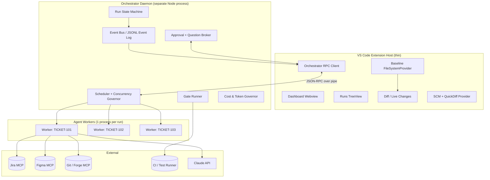
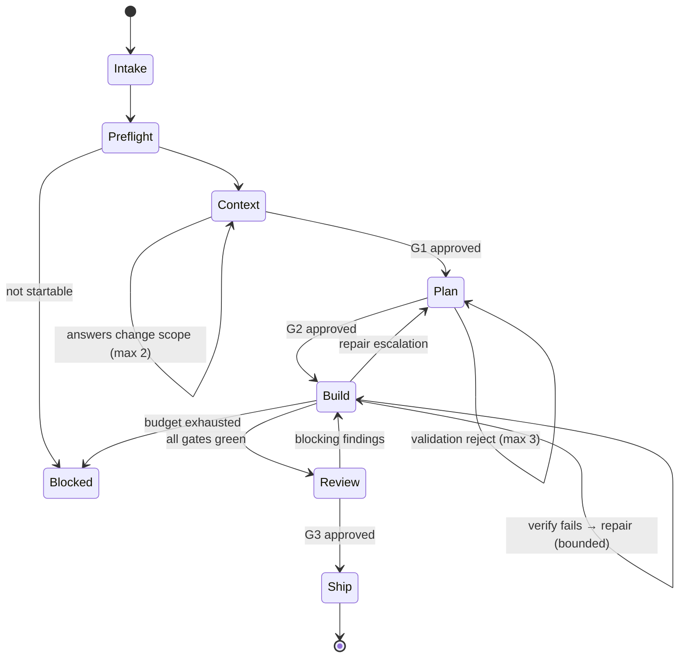

# AgentFlow — A Multi-Agent Ticket-to-PR Workflow Extension for VS Code

**Architecture and implementation plan**
Target runtime: VS Code extension (standalone, no dependency on other AI extensions)
Primary model provider: Claude, via `@anthropic-ai/claude-agent-sdk`
Version: 1.0 draft

---

## 1. Scope

### 1.1 What this system does

Two workflows, one engine, one inbox.

**Deliver** — a Jira ticket becomes a reviewed, tested, green pull request:

```
Intake ─▶ Preflight ─▶ Context ─▶ Plan ─▶ Build ─▶ Review ─▶ Ship ─▶ (you push)
                          [G1]      [G2]   (loop)    [G3]
```

**Review** — a GitHub PR assigned to you gets an AI review, grounded in an actual test run:

```
Intake ─▶ Preflight ─▶ Context ─▶ Review ─▶ Publish
                                    [G3]
```

Both start from the **Work Inbox** (§6): saved Jira queries (by label, component, epic, status) and saved GitHub PR queries (review-requested, assigned, your own failing PRs) in one list. You read the item, click start, and watch it run — several at a time, each in its own git worktree, all streaming into one dashboard.

Seven phase names, shared by both workflows. The review workflow simply skips Plan and Build.

### 1.2 Goals

| # | Goal | How it is measured |
|---|---|---|
| G1 | Jira ticket → PR with no manual context assembly | Time from "start" to "PR open" |
| G2 | Human approves *decisions*, not keystrokes | ≤ 3 mandatory gates per ticket; ≤ 5 clarifying questions per phase |
| G3 | Correctness is machine-verified, never model-asserted | 100% of "done" transitions backed by a command exit code |
| G4 | N tickets in parallel with visible live state | 4+ concurrent runs on a 16 GB dev machine |
| G5 | Everything is resumable and auditable | Kill the window mid-run; resume with no loss of decisions |
| G6 | Reversible by construction | One command restores the repo to any checkpoint |
| G7 | Inbound PRs reviewed with the same rigour | Findings backed by a real local test run, never auto-posted |

### 1.3 Non-goals (v1)

- Not a chat IDE. Free-form chat exists only as a side channel on a run.
- Not autonomous publishing. The tool does not push, open PRs, or move tickets on its own; it prepares and hands off. A human pushes, and a human merges.
- Not multi-repo per ticket (single repo per run; cross-repo is v2).
- Not a hosted service. Local-first; a remote executor is a v2 seam, designed for but not built.
- Not model-agnostic in v1. Claude first; the provider seam exists (§19.3) but only one implementation ships.

### 1.4 The one non-negotiable invariant

> **The model proposes; the runner decides.**
> No phase advances because an agent said it was finished. A phase advances because a *gate* — a deterministic command, a schema validation, or a human click — returned success. Model output is evidence, never verdict.

Every design choice below follows from this.

---

## 2. System overview

### 2.1 Component map



### 2.2 The three-tier rule

| Tier | Runs where | Owns | Never does |
|---|---|---|---|
| **Extension host** | VS Code process | Rendering, user intent capture, editor integration | Model calls, test execution, long loops |
| **Orchestrator** | Child Node process, one per workspace | Scheduling, state machine, gates, persistence, approvals | Touch the VS Code API |
| **Worker** | Child process per active run | One agent session, one worktree | Talk to the UI directly, mutate shared state |

Rationale: the extension host is single-threaded and shared with every other extension. A blocked event loop freezes the editor. A crashed agent must not take down the window, and a window reload must not kill a 40-minute run. This separation is the single highest-value structural decision in the design; everything about resumability and parallelism depends on it.

The orchestrator is spawned lazily on first use, holds a lockfile at `.agentflow/orchestrator.lock`, and survives extension reloads. On activation, the extension attempts to attach to an existing daemon before spawning.

### 2.3 Transport

`vscode` ⇄ `orchestrator`: JSON-RPC 2.0 over a named pipe (Windows) / unix domain socket (macOS, Linux), framed with `Content-Length` headers (reuse `vscode-jsonrpc`).

`orchestrator` ⇄ `worker`: Node `child_process.fork` IPC with a typed message envelope. Workers are cheap to kill and are treated as disposable.

All UI updates are **push**. The extension subscribes to an event stream and never polls.

---

## 3. Domain model

### 3.1 Entities

```typescript
type RunId = string;          // uuid
type TicketKey = string;      // "PAY-1423"

interface Run {
  id: RunId;
  pipeline: Pipeline;
  source: TicketRef | PullRequestRef;   // deliver | review
  repo: RepoRef;
  worktree: WorktreePath;
  branch: string;
  phase: Phase;
  step: Step;
  status: RunStatus;
  attemptBudget: AttemptBudget;
  cost: CostLedger;
  createdAt: number;
  artifacts: Record<ArtifactKind, ArtifactRef>;
  sessions: Record<Phase, ClaudeSessionRef>;   // for resume / fork
}

type Pipeline = 'deliver' | 'review';

// What the human sees: seven phases, both pipelines.
type Phase =
  | 'intake' | 'preflight' | 'context' | 'plan' | 'build' | 'review' | 'ship';

// What the engine tracks inside a phase. Never rendered as a top-level pill.
type Step =
  | 'classify' | 'map_repo'                          // intake
  | 'worktree' | 'detect_gates' | 'check_auth' | 'check_budget' | 'baseline_gates'  // preflight
  | 'harvest' | 'draft_spec' | 'questions'           // context
  | 'draft_plan' | 'validate_plan' | 'decompose'     // plan
  | 'implement' | 'verify' | 'repair'                // build
  | 'auto_review' | 'triage_findings' | 'human_review' // review
  | 'rebase' | 'push' | 'publish' | 'notify';        // ship

type RunStatus =
  | 'queued' | 'running'
  | 'waiting_human'         // blocked on a gate or a question
  | 'blocked'               // external failure: auth, CI down, merge conflict
  | 'failed' | 'cancelled' | 'succeeded';

interface ArtifactRef {
  kind: ArtifactKind;        // 'spec' | 'plan' | 'taskgraph' | 'review' | 'testreport' | 'diff'
  version: number;           // artifacts are versioned, never overwritten
  path: string;              // .agentflow/runs/<id>/artifacts/plan.v3.json
  approvedBy?: string;
  approvedAt?: number;
  schemaVersion: string;
}
```

### 3.2 Task graph

The plan compiles to a DAG, not a list. This is what makes parallel sub-work and precise retry possible.

```typescript
interface Task {
  id: string;                     // "T3"
  title: string;
  intent: string;                 // what changes and why
  files: string[];                // predicted touch set (advisory, checked later)
  dependsOn: string[];            // DAG edges
  acceptance: AcceptanceCriterion[];
  verification: GateSpec[];       // which gates must pass for THIS task
  risk: 'low' | 'medium' | 'high';
  estimatedEdits: number;
  status: 'pending' | 'active' | 'verifying' | 'repairing' | 'done' | 'abandoned';
  attempts: Attempt[];
}

interface AcceptanceCriterion {
  id: string;
  statement: string;              // human-readable
  check: GateSpec | 'manual';     // MUST be machine-checkable unless explicitly manual
}
```

Rule enforced at plan-validation time: **every task must carry at least one non-`manual` acceptance check**, or the plan is rejected back to the planner with the specific task ID. This is what stops the classic failure where the agent writes plausible code and declares victory.

### 3.3 State is an event log

Each run owns an append-only JSONL log: `.agentflow/runs/<runId>/events.jsonl`.

```typescript
type RunEvent =
  | { t: 'phase_entered'; phase: Phase; at: number }
  | { t: 'artifact_written'; kind: ArtifactKind; version: number }
  | { t: 'question_asked'; question: Question }
  | { t: 'question_answered'; questionId: string; answer: Answer }
  | { t: 'approval_requested'; gate: GateId; artifact: ArtifactRef }
  | { t: 'approval_decided'; gate: GateId; decision: 'approve'|'reject'|'revise'; note?: string }
  | { t: 'tool_call'; tool: string; input: unknown; toolUseId: string }
  | { t: 'tool_result'; toolUseId: string; ok: boolean; summaryLine: string }
  | { t: 'file_changed'; path: string; op: 'create'|'modify'|'delete'; hunks: number }
  | { t: 'checkpoint'; label: string; commitSha?: string; messageUuid?: string }
  | { t: 'gate_result'; gate: GateId; ok: boolean; durationMs: number; report: GateReport }
  | { t: 'cost'; usd: number; inputTokens: number; outputTokens: number; model: string }
  | { t: 'error'; scope: string; message: string; retryable: boolean };
```

The UI state, the audit trail, the resume logic, and the post-hoc evals are all derived from this one log. A periodic snapshot (`state.json`) exists purely as a read optimization and can be rebuilt by replay at any time.

---

## 4. Process and isolation model

### 4.1 One worktree per run

```
repo/                              # user's checkout, never touched by agents
  .agentflow/
    config.json
    orchestrator.lock
    runs/<runId>/{events.jsonl,state.json,artifacts/,logs/}
    worktrees/PAY-1423/            # git worktree, branch agentflow/PAY-1423
    worktrees/PAY-1451/
```

`git worktree add .agentflow/worktrees/PAY-1423 -b agentflow/PAY-1423 origin/main`

Why real worktrees rather than an in-memory or shadow filesystem:

- Builds and tests are real. Gradle, node, compilers, and language servers all need a real tree. A virtual FS would force you to materialize before every gate anyway.
- Isolation is free and total. Two agents cannot collide, and neither can touch the user's dirty working copy.
- Rollback is `git reset`/`git checkout`, not custom bookkeeping.
- Cleanup is `git worktree remove`.

Cost: disk (mitigate with `--reference` or a shared object store; worktrees already share `.git/objects`) and cold build caches per tree (mitigate by pointing `GRADLE_USER_HOME` / build caches at a shared directory — see §14.6).

### 4.2 Worker lifecycle

```
spawn ─▶ attach worktree ─▶ warm SDK subprocess (startup())
      ─▶ run phase ─▶ emit events ─▶ persist session id
      ─▶ idle (kept warm N minutes) ─▶ exit
```

The Agent SDK's `startup()` pre-warms the CLI subprocess and completes the initialize handshake before a prompt exists, so the first real query does not pay spawn cost inline. The pool keeps one warm process per active run plus one spare.

### 4.3 Concurrency governor

Parallelism is bounded by the *scarcest* resource, not by a single number:

```typescript
interface ConcurrencyLimits {
  maxActiveRuns: number;          // default 4
  maxConcurrentGateJobs: number;  // default 2  — tests are CPU/memory hogs
  maxConcurrentModelCalls: number;// default 6  — respects API rate limits
  maxWorktrees: number;           // default 8  — disk guard
}
```

Gate execution (compilation, test suites) goes through a **separate semaphore** from model calls. In practice this is what makes 4 parallel tickets usable: four agents can think at once, but only two can run a Gradle build at once. Without this split, the machine thrashes and every run gets slower than it would have been serially.

Runs also carry a priority and are preemptible in `waiting_human` state — a run blocked on a human question releases its gate slot immediately.

---

## 5. The pipeline

### 5.1 Seven phases

| # | Phase | The question it answers | Model | Artifact | Exit gate | Human |
|---|---|---|---|---|---|---|
| 1 | **Intake** | What am I working on? | Haiku | `source.json` | `INTAKE_OK` | — |
| 2 | **Preflight** | Can I safely start? | none | `preflight.json` | `PREFLIGHT_OK` | only on failure |
| 3 | **Context** | What do I need to know, and what's ambiguous? | Sonnet subagents → Opus | `context.json`, `spec.json` | `SPEC_VALID` | **G1** |
| 4 | **Plan** | How will I do it? | Opus | `plan.json`, work packets | `PLAN_VALID` | **G2** |
| 5 | **Build** | Do it, and prove it | Sonnet (loop) | diff, gate reports | `ALL_GATES_GREEN` | — |
| 6 | **Review** | Is this mergeable? | Opus (cold) | `review.json` | `REVIEW_CLEAR` | **G3** |
| 7 | **Ship** | Prepare it to land | none | rebased branch, PR package | `PR_PACKAGE_READY` | hands off |

Seven pills in the UI. Everything finer-grained is a `Step` (§3.1) shown in the run detail, not on the board.



The three human gates sit at the end of Context, Plan, and Review. Nothing else interrupts you.

### 5.2 Phase 1 — Intake

**Deliver:** the selected Jira issue is fetched in full — summary, description, ACs, comments, attachments, links, epic, sprint — and normalized into a `TicketRef` with provenance on every field (which comment, which author, when). Design links (`figma.com/…`) are extracted from description, comments, and attachments.

**Review:** the selected PR is fetched — metadata, diff, commits, files, CI status, linked issue, and **existing review comments** (so the agent does not restate what a human already said).

Then classify: `feature | bug | refactor | chore | spike` for tickets, `size × risk` for PRs. The class selects the pipeline profile (§5.9).

**Gate `INTAKE_OK`** (deterministic): the item exists, is accessible, and maps to a configured repo. Missing ACs is a warning, not a blocker — Context exists to handle that.

### 5.3 Phase 2 — Preflight

Entirely deterministic, no model, fast. This phase exists because most agent-run failures are environmental, and discovering them at minute 25 instead of minute 1 wastes both money and trust.

| Check | Failure behaviour |
|---|---|
| Integration auth valid (Jira, GitHub, Figma) | `blocked`, prompt to re-auth |
| Base branch resolvable, `origin` reachable | `blocked` |
| Worktree created and on the right branch | `blocked` |
| Gate adapters detected for this repo (§14.2) | Warn; ask which to use |
| **Baseline gate run** — do L0–L3 pass on the untouched base? | Warn loudly; the run continues but pre-existing failures are excluded from the blocking set |
| Budget and concurrency slots available | Queue |
| Disk headroom for another worktree | Refuse |
| No other active run on the same ticket/branch | Offer to attach instead |
| Ticket size within threshold | Suggest a split, ask human |

The baseline gate run is the highest-value check here. Without it, an agent inherits blame for a broken `main` and burns its whole repair budget chasing failures it did not cause.

**Artifact:** `preflight.json` — a checklist with results, plus the baseline failure set.

### 5.4 Phase 3 — Context

Two steps and a gate.

**Step `harvest`** — five read-only subagents run in parallel, each returning a bounded, schema-valid digest rather than raw output:

| Subagent | Produces |
|---|---|
| `repo-cartographer` | Module map, build graph, where this kind of change lives, existing patterns for the same concern |
| `history-archaeologist` | `git log`/`blame` on candidate files, prior related PRs, ownership, past reverts here |
| `design-reader` | Figma frames → component inventory, tokens, states, deltas vs. current implementation |
| `contract-reader` | API schemas, DTOs, feature flags, config keys touched |
| `test-cartographer` | Test layout, fixtures, helpers, conventions — what "a good test here" looks like |

Subagents rather than one large session, for context economy: five 30k-token explorations would swamp the parent; five 1–2k digests do not. The parent never sees the raw exploration. → `context.json`

**Step `draft_spec`** — the Analyst (Opus, read-only, high effort) turns ticket + context into `spec.json`:

```jsonc
{
  "problem": "…",
  "inScope": ["…"], "outOfScope": ["…"],
  "acceptanceCriteria": [
    { "id": "AC1", "statement": "…", "source": "jira:comment:88231", "checkable": true }
  ],
  "affectedSurfaces": { "modules": [], "apis": [], "screens": [], "flags": [] },
  "designReferences": [{ "figmaNode": "12:345", "frame": "Checkout / Empty state" }],
  "assumptions": [{ "id": "A1", "statement": "…", "confidence": 0.6, "impactIfWrong": "high" }],
  "openQuestions": [ /* Question objects, see §9.2 */ ],
  "nonFunctional": { "perf": "…", "security": "…", "accessibility": "…", "telemetry": "…" },
  "rollback": "…"
}
```

**Gate `SPEC_VALID`:** schema-valid; every AC traces to a real ticket field, comment, or design node; every high-impact assumption has a matching open question. The `source` requirement is the cheapest available defence against invented scope — the model cannot fill the field without pointing at something real.

**Step `questions` → HUMAN GATE 1.** Questions are batched into one form, capped at five, and each must declare what the agent already checked (§9.2). If the answers materially change `inScope`/`outOfScope`, the phase re-runs `draft_spec` once. Loop limit 2.

### 5.5 Phase 4 — Plan

**Step `draft_plan`** — the Planner (Opus, read-only) forks the Analyst session and emits a task **DAG**, not a list (§3.2), plus:

```jsonc
{
  "strategy": "…max 200 words…",
  "tasks": [ /* Task[] with dependsOn, acceptance, verification, risk */ ],
  "testStrategy": {
    "newTests": [{ "task": "T2", "file": "…", "cases": ["…"] }],
    "reproTest": { "required": true, "task": "T1" },
    "regressionRisk": ["…"]
  },
  "featureFlag": { "required": true, "key": "checkout_empty_state_v2" },
  "migrations": [], "rollbackPlan": "…",
  "outOfPlanPolicy": "ask"
}
```

**Step `validate_plan` — machine gate `PLAN_VALID`, before any human sees it.** Never spend human attention on a malformed plan:

1. Schema-valid. 2. DAG acyclic, no orphans. 3. **Every task has ≥1 machine-checkable acceptance criterion.** 4. Every spec AC maps to ≥1 task, and every task maps back to ≥1 AC. 5. Predicted touch set exists on disk or is a plausible new path. 6. Bug profile ⇒ a reproduction-test task ordered first. 7. Estimated edits within budget, else the plan must propose a split.

Failures return to the planner with the exact rule ID and offending element, up to 3 attempts, then escalate with the validation report attached.

**HUMAN GATE 2.** The plan renders as an editable review: approve, approve-with-edits (delete, reorder, rewrite tasks inline), request revision with a comment, or reject. Edits produce `plan.v(N+1)` marked `editedBy: human`, with the version diff preserved.

**Step `decompose`** — mechanical, no model. Compile the approved plan into self-contained **work packets**:

```typescript
interface WorkPacket {
  task: Task;
  contextSlice: { files: string[]; specExcerpt: string; conventions: string[]; designNodes?: FigmaNodeRef[] };
  gates: GateSpec[];
  guardrails: {
    allowedPaths: string[];       // glob allowlist → enforced in the PreToolUse hook
    forbiddenPaths: string[];     // **/build.gradle.kts, **/*.pem, .github/**
    maxFilesTouched: number;
    maxNewDeps: 0 | number;       // any dependency addition needs human approval
  };
}
```

Guardrails are the enforceable version of "stay in scope" — code, not prompt instruction (§9.4).

### 5.6 Phase 5 — Build

One phase, three steps, cycling per task in DAG order. Independent tasks run concurrently when their `allowedPaths` are disjoint and a model slot is free.

**`implement`** — Sonnet, `acceptEdits` scoped to the worktree, `enableFileCheckpointing: true`. Checkpoint first (SDK message UUID + `git stash create` sha), read the context slice, then edit. Every write passes the `PreToolUse` hook (path allowlist, secret scan, generated-file guard). Every tool result streams to the UI as a `file_changed` event.

**`verify`** — deterministic, no model in the decision path. Runs the task's gates fastest-first (§14.1) and parses output into structured failures rather than dumping logs into context:

```typescript
interface GateReport {
  gate: GateId; ok: boolean; exitCode: number; durationMs: number;
  failures: Failure[];     // parsed {file,line,rule,message}, top 20 to the model
  raw: string;             // path to the full log on disk
  signature: string;       // normalized failure hash — the loop's progress metric
}
```

**`repair`** — the bounded convergence loop with failure signatures, an escalation ladder, and hard blocks on the ways agents fake success. This is the correctness engine and gets its own section: §11.

Commits happen per task, **after** its gates pass, so history stays bisectable.

**Gate `ALL_GATES_GREEN`:** every task done, every task's gates green, full-suite L0–L8 green on the current tree.

### 5.7 Phase 6 — Review

**`auto_review`** — the Reviewer (Opus) in a **fresh session with no implementer context**: it sees the spec, the approved plan, the diff, and the gate reports, and nothing of the implementer's reasoning. A reviewer that inherits the implementer's context inherits its blind spots and tends to ratify.

Four passes, each a narrow subagent: `correctness`, `conformance` (diff vs. plan, scope creep, layering), `security`, `maintainability` (including: does the test actually assert?). Output `review.json` with severity-tagged findings, evidence, suggested fix, confidence, plus a `planConformance` verdict.

**Gate `REVIEW_CLEAR`:** zero unresolved `blocker` or `major`. Those feed back into Build as repair tasks. `minor`/`nit` surface to the human without blocking.

Anti-sycophancy: a review returning zero findings on a diff over ~150 changed lines triggers one automatic adversarial re-review before it is accepted.

**`triage_findings` → HUMAN GATE 3.** One surface: the full diff in VS Code's native diff editor, findings pinned as inline diagnostics, gate summary with timings and coverage delta, plan conformance with unplanned files highlighted, cost and duration. Actions: **Approve → ship** · **Comment → back to Build** (comments become repair tasks, verbatim) · **Reject → abandon, keep branch** · **Take over → agent stands down, worktree opens in a window.**

### 5.8 Phase 7 — Ship

**Ship prepares the branch and stops.** Pushing, opening the PR, and moving the ticket are
human actions by default.

1. Rebase onto the base branch. Any textual conflict → `blocked` + human; auto-resolution is not attempted (§13.3).
2. **Re-run the full gate ladder on the rebased tree.** The earlier green was on a different tree.
3. Assemble the **PR package** locally: title, body generated from spec + plan + gate summary + a "how to verify manually" section, the ticket link, and the audit bundle. Written to `artifacts/pr-package.md`. Nothing leaves the machine.
4. **Hand off.** The run parks in `waiting_human` with a *Ready to push* card: branch name, commit list, diffstat, gate summary, and the PR body ready to copy. You push, you open the PR, you move the ticket.
5. Only if `ship.autoPush` is enabled — off by default, and separately `ship.autoTransitionTicket` — does the run push, open the PR, and comment on the ticket itself.
6. Keep the worktree for a TTL (default 7 days) so you can pick it up, then GC.

Why manual is the default: the push is the first irreversible, externally-visible step, and it
is the one place where a human glance is cheapest and being wrong is most expensive. It is
also the difference between a tool a team will pilot and one security and your tech lead have
to argue about first. Autonomy here should be earned with the eval numbers in §18.3, not
assumed on day one.

The mechanics cost nothing extra: `waiting_human` already releases the run's slot (§4.3) and
already re-surfaces after a restart (§15.2), so a run parked at handoff behaves exactly like
one parked at G2.

### 5.9 Profiles: which phases actually run

| Profile | Pipeline | Skips | Adds |
|---|---|---|---|
| `feature` | deliver | — | Full pipeline |
| `bug` | deliver | — | Mandatory reproduction test before fix; regression test required |
| `chore` | deliver | Context Q&A, Figma harvest | — |
| `refactor` | deliver | Spec Q&A | Behaviour-preservation gate: no public API change, no test edits |
| `spike` | deliver | Build, Ship | Document + throwaway branch only |
| `pr-review` | review | **Plan, Build** | Claim-conformance pass; local gate run on PR head (§7) |
| `pr-fix` | deliver | Context harvest (inherited from the review run) | Branches from the PR head |

Profile is chosen at intake and overridable by the human at G1.

---

## 6. The Work Inbox

Nothing starts by itself. The inbox is where you see candidate work, read it, and decide.

### 6.1 One list, three sources

```
WORK INBOX
├─ Tickets
│   ├─ Checkout v2            (7)     ← saved Jira query: label = checkout-v2
│   ├─ My bugs                (3)
│   └─ Sprint 42 ready        (11)
├─ Pull Requests
│   ├─ Awaiting my review     (5)     ← saved GitHub query: review-requested:@me
│   ├─ My PRs needing work    (2)     ← failing CI or unresolved comments
│   └─ Team queue             (9)
└─ Runs
    ├─ Needs you              (1)     ← questions + approvals, badge on the icon
    ├─ Active                 (3)
    └─ Recent                 (12)
```

One TreeView in the activity bar. The "Needs you" group always sorts first — it is the only thing in the extension that is allowed to nag.

### 6.2 Source configuration

Saved queries, committed to the repo so a team shares them, with a per-user override file for personal queries.

```jsonc
// .agentflow/sources.json
{
  "jira": {
    "queries": [
      { "id": "checkout-v2", "label": "Checkout v2",
        "jql": "project = PAY AND labels IN (checkout-v2) AND status = 'Ready for Dev' ORDER BY rank ASC",
        "refreshSec": 300, "defaultProfile": "feature" },
      { "id": "my-bugs", "label": "My bugs",
        "builder": { "project": "PAY", "type": ["Bug"], "assignee": "currentUser()",
                     "status": ["Ready for Dev", "In Progress"], "labels": [] },
        "defaultProfile": "bug" }
    ]
  },
  "github": {
    "queries": [
      { "id": "to-review", "label": "Awaiting my review",
        "search": "is:open is:pr review-requested:@me archived:false sort:updated-desc",
        "defaultProfile": "pr-review" },
      { "id": "my-failing", "label": "My PRs needing work",
        "search": "is:open is:pr author:@me status:failure" },
      { "id": "team", "label": "Team queue",
        "search": "is:open is:pr team-review-requested:acme/payments draft:false" }
    ]
  }
}
```

Two ways to define a Jira query, because both audiences exist: raw `jql` for people who know JQL, and a `builder` object (project + labels + components + type + status + assignee + epic) that the settings UI renders as dropdowns and compiles to JQL. The builder always shows the generated JQL, editable — a filter UI you cannot see through is a filter UI you stop trusting.

### 6.3 Item cards and readiness chips

Each row carries cheap, computed signals so you can triage without opening anything. These are deterministic (no model calls) except the one-line summary, which is Haiku-generated and cached by content hash.

**Ticket chips:** `no ACs` · `has design` · `~S/M/L` (from description length, AC count, linked components) · `blocked by PAY-1400` · `no repo mapping` · `stale 94d` · `branch exists` · `run in progress`.

**PR chips:** `+412 −38` · `9 files` · `CI ✗` · `conflicts` · `2 approvals` · `draft` · `touches security/**` · `no linked ticket` · `reviewed at abc123` (already reviewed this sha) · `age 6d`.

Red chips are advisory, not blocking. `no ACs` on a ticket means Context will spend a question on it; `no repo mapping` means the run cannot start until you say which repo.

### 6.4 Refresh, caching, and rate limits

- Poll per query on its own interval (default 300 s tickets / 120 s PRs), with jitter, backing off to 15 min when the window is unfocused and pausing entirely when it is hidden.
- Conditional requests: ETag / `If-Modified-Since` on GitHub, `updated >= ` clamps on JQL.
- Everything cached to disk; the inbox renders instantly from cache on activation and refreshes behind it. Offline shows the cache with a staleness badge rather than an empty list.
- Hard cap of 200 items per query with a "refine your query" prompt beyond that. A query returning 500 tickets is a broken query, and paging through it is not the fix.
- Optional webhooks (GitHub) for near-real-time PR updates when a repo admin can configure them; polling remains the default because most people cannot.

### 6.5 Read, then start

Clicking a row opens a **detail panel**, not a run. The panel shows the normalized item — description, ACs, comments, links, design thumbnails; for PRs, the diffstat, CI status, and existing comments — plus the readiness chips expanded into reasons.

Starting is explicit. The start dialog is the last cheap moment to set direction, so it exposes exactly the things worth choosing:

```
Start run — PAY-1423
  Pipeline    ● Deliver        ○ Review
  Profile     [feature ▾]      Repo [payments-android ▾]
  Base        [origin/main ▾]  Branch [agentflow/PAY-1423]
  Budget      [$8]  [90 min]   Autonomy [G1 G2 G3 ▾]
  ☐ Skip Context Q&A (I've already answered everything in the ticket)
  ☐ Start paused (set up the worktree, don't run yet)
                                        [Cancel]  [Start]
```

**Queue, don't refuse.** Selecting several rows and hitting start enqueues them; the concurrency governor (§4.3) admits them as slots free up. A queued run shows its position and can be reordered by drag.

### 6.6 What the inbox deliberately does not do

- **No auto-start.** A watcher can *surface* tickets entering "Ready for Dev" as a notification; it never launches a run. Auto-start is a v2 setting, off by default, and only after the eval numbers in §18.3 justify it.
- **No write-back on browse.** Reading a ticket in the inbox does not transition it, assign it, or comment on it. The first Jira write in a run is previewed to you.

---

## 7. The PR review pipeline

### 7.1 Why this ships early

Reviewing inbound PRs is read-only against your own repo, needs no plan approval, cannot write bad code, and produces something a teammate values on day one. It is the lowest-risk, highest-trust entry point for the whole tool — and it reuses the review engine you need anyway (§5.7). If you want something in colleagues' hands quickly, this is the thing to ship.

### 7.2 Phase mapping

| Phase | What it does for a PR |
|---|---|
| Intake | Fetch PR: metadata, diff, commits, files, CI status, linked issue, **existing review comments** |
| Preflight | Worktree at the PR head (`git fetch origin pull/N/head`), compute merge base, detect gates, size guard |
| Context | What the PR *claims* (title, body, linked ticket) vs. what it *touches*; module ownership, prior art, related past PRs, design refs if the ticket has them |
| ~~Plan~~ | skipped |
| ~~Build~~ | skipped |
| Review | Four standard passes + claim-conformance + **a real local gate run on the PR head** |
| Ship → Publish | Human triages findings; approved ones post as a single GitHub review |

### 7.3 The differentiator: run the tests

Most AI PR reviewers read the diff. This one has a worktree, so it can check out the PR head and actually execute the gate ladder — compile, lint, unit, coverage delta on the changed lines, secret scan. A finding that says "this test fails" carries a stack trace, not a hunch.

Baseline comparison matters here too: run gates on the merge base as well, and report only the delta. Otherwise every PR into a repo with three pre-existing failures gets three false findings.

Cost control: the local gate run is opt-in per query (`"runGates": true`), skipped for PRs above a size threshold, and cached by head sha so re-opening a review does not re-run anything.

### 7.4 Claim conformance

A review pass unique to this pipeline: does the PR do what it says?

- Description mentions changes not present in the diff → finding.
- Diff contains substantive changes the description does not mention → finding, severity scaled by risk (a refactor buried in a bugfix PR is exactly what you want caught).
- Linked ticket's ACs not addressed → finding.
- Unrelated files touched (formatting churn, IDE config, version bumps) → grouped into one `nit`, never one per file.

### 7.5 Findings triage — and never auto-post

Findings land in a triage view, one row each: severity, file, line, claim, evidence, suggested fix, confidence. For each: **accept** (goes in the review), **edit** (rewrite the comment in your voice), **dismiss** (with a reason, logged for eval).

Then publish as **one** GitHub review — batched, not a comment per finding — with a summary body noting what the AI checked and what it ran.

Two hard rules, both enforced in code:

1. **The extension never submits an `APPROVE` review.** Only `COMMENT` or `REQUEST_CHANGES`, and only after human triage. An approval is your signature on someone else's code; a tool must not forge it.
2. **Nothing posts without an explicit click.** No "auto-post if confidence > 0.9" setting exists. Draft-and-review is the only mode.

Deduplication: never post a finding that overlaps an existing human comment on the same lines, and never re-review a head sha already reviewed (the `reviewed at abc123` chip). Force-push to the PR invalidates the cache and offers a re-review of the delta only.

### 7.6 Escalating from review to fix

From a completed review: **"Fix these findings."** This starts a `pr-fix` deliver run branched from the PR head, seeded with the accepted findings as tasks and the review's context (no re-harvest). Output lands on a follow-up branch and stops there, like any other run (§5.8): you push it and decide whether it becomes a PR against the original branch or a direct push to it.

This is the loop that makes the review pipeline more than an opinion generator, and it costs almost nothing to build once both pipelines share phases.

### 7.7 GitHub API surface

| Capability | Used for | Write? |
|---|---|---|
| Search issues/PRs | Inbox queries | no |
| Get PR, files, commits | Intake | no |
| Get combined status / check runs | CI chips, gate skipping | no |
| List review comments | Dedupe against humans | no |
| Create review (COMMENT / REQUEST_CHANGES) | Publish, human-triggered | yes |
| Create PR | Ship, `pr-fix` | yes |
| Fetch `pull/N/head` | Preflight worktree | no |

Auth via GitHub App or a fine-grained PAT in `SecretStorage`, scoped to the repos in config. Ask for the narrowest scopes that work, and document them — a review tool requesting broad write access is a tool security review will reject.

## 8. Multi-agent topology

### 8.1 Roles

| Role | Model tier | Permission mode | Session strategy | Thinking |
|---|---|---|---|---|
| Triage | Haiku | read-only | ephemeral | off |
| Harvest subagents (×5) | Sonnet | read-only | subagents of one parent | low |
| Analyst (spec) | Opus | read-only | own session, resumable | high |
| Planner | Opus | read-only | forks the analyst session | high |
| Implementer | Sonnet | acceptEdits, scoped | one session per run, resumed per task | medium |
| Verifier | *none* | n/a | deterministic runner | n/a |
| Repair agent | Sonnet → Opus on escalation | acceptEdits, scoped | fork of implementer, or fresh on escalation | medium → high |
| Reviewer (×4 passes) | Opus parent + Sonnet passes | read-only | fresh session, cold | high |
| Summarizer | Haiku | none | ephemeral | off |

Model IDs are configuration, not code. Ship with a defaults file mapping tier → model string and validate at startup against `query().supportedModels()`, so a model rename never bricks the extension.

### 8.2 Subagent vs. new session — the decision rule

- **Subagent** (`options.agents`) when the work is a bounded exploration whose *conclusion* matters and whose *process* does not. The parent gets a digest; the tokens spent exploring never enter the parent's context. All five harvest explorers, and all four review passes, are subagents.
- **New top-level session** when the work needs a genuinely clean slate for epistemic reasons — the reviewer must not inherit the implementer's rationalizations.
- **Fork** (`resume` + `forkSession: true`) when you want shared history but divergent futures — e.g. Planner forking the Analyst session, or trying two repair strategies against the same failure and keeping the winner.
- **Resume** (`resume: sessionId`) for the implementer across tasks in one run: the accumulated understanding of the codebase is the asset.

### 8.3 Context discipline

The failure mode of long agentic runs is context rot: by turn 60 the model is reasoning over its own stale summaries. Countermeasures, in order of effectiveness:

1. **Artifacts, not conversation.** Each phase's output is a file. The next phase reads the file. Phases do not inherit chat history except where §8.2 says so.
2. **Digest-returning subagents.** Nothing raw crosses a phase boundary.
3. **Structured tool output.** `outputFormat: json_schema` on every phase whose result the orchestrator consumes.
4. **Parsed gate output.** Top-20 failures, never raw logs.
5. **Context watermark.** Poll `query().getContextUsage()`; at 60% of window, checkpoint and hand off to a fresh session seeded with the artifact set rather than letting compaction happen implicitly.
6. **Tool budget per phase** (`maxTurns`), so a stuck loop terminates rather than grinding.

### 8.4 Orchestration is code, not a model

There is no "orchestrator agent" deciding what happens next. Phase transitions, retries, escalations, and gate selection are ordinary TypeScript in the state machine. Models are called *inside* phases to do the phase's work.

This is a deliberate rejection of the fully-autonomous-orchestrator pattern. A deterministic controller is debuggable, testable, resumable, and auditable; a model controller is none of those, and buys flexibility this problem does not need — the pipeline is genuinely a fixed pipeline.

---

## 9. Human-in-the-loop protocol

### 9.1 Three mandatory gates, no more

| Gate | Question the human answers | Artifact |
|---|---|---|
| G1 Clarify | "Is my understanding right, and how do I resolve these ambiguities?" | spec + questions |
| G2 Plan | "Is this the right approach and decomposition?" | plan DAG |
| G3 Diff | "Is this code I would merge?" | diff + review + gates |

Everything else is either machine-decided or a *notification*. Approval fatigue destroys these tools faster than bad code does: if the human clicks "yes" thirty times per ticket, by ticket three they are clicking without reading, and the gates become theatre.

### 9.2 The question protocol

Agents may only ask via a single in-process MCP tool, `ask_human`, registered with `createSdkMcpServer`. Free-text questions in assistant prose are ignored by the orchestrator and the UI does not render them.

```typescript
const askHuman = tool(
  'ask_human',
  'Ask the human a blocking or non-blocking clarifying question. Use only after ' +
  'attempting to answer from the repo, the ticket, and the designs. State what you already checked.',
  {
    question: z.string().max(280),
    whyItMatters: z.string().max(200),
    alreadyChecked: z.array(z.string()).min(1),   // forces an evidence attempt first
    options: z.array(z.object({
      label: z.string(), implication: z.string()
    })).max(4).optional(),
    allowFreeText: z.boolean().default(true),
    blocking: z.boolean(),
    defaultIfUnanswered: z.string().optional(),
    confidenceWithoutAnswer: z.number().min(0).max(1)
  },
  async (args, { signal }) => broker.enqueue(args, signal)
);
```

Enforced constraints:

- **Batched.** The broker holds questions until the phase ends or a 20-second quiescence timer fires, then presents them as one form. Never one modal at a time.
- **Capped.** Max 5 per phase. The 6th returns a tool error telling the agent to proceed with its best assumption and record it in `assumptions[]` instead. This cap is a forcing function: it makes the agent spend its questions on what actually matters.
- **Evidence-gated.** `alreadyChecked` is required and non-empty. Reviewing these entries is how you discover that the agent is asking questions the repo already answers, which is a prompt problem, not a user problem.
- **Answerable asynchronously.** A run in `waiting_human` releases its resources. The human can answer three runs' questions in one sitting from the dashboard.
- **Timeout policy** per config: `wait_forever` (default) | `use_default_after(duration)` | `escalate_to(user)`.

### 9.3 Approvals

```typescript
interface ApprovalRequest {
  runId: RunId; gate: 'G1'|'G2'|'G3';
  artifact: ArtifactRef;
  diffAgainst?: ArtifactRef;      // for re-approval after revision, show only what changed
  summary: string;                // ≤ 3 sentences, Haiku-generated
  decisions: Decision[];          // the specific choices being ratified
  risks: string[];
  cost: { soFarUsd: number; projectedUsd: number };
}
```

Re-approval after a revision shows a **diff of the artifact**, not the whole artifact again. This is the single biggest determinant of whether gate 2 stays meaningful across revisions.

### 9.4 Tool-level permissions (the safety net under the gates)

Three enforcement layers, all in code:

**Layer 1 — `PreToolUse` hook.** Runs before every tool call. Deterministic policy: path allowlist from the work packet, forbidden-path denylist, secret-pattern scan of write payloads, dependency-file guard, destructive-command patterns (`rm -rf`, `git push --force`, `DROP TABLE`, credential exfiltration shapes). Returns `permissionDecision: 'deny'` with a reason the model can act on.

**Layer 2 — `canUseTool` callback.** For calls that fall through policy to a prompt. Auto-approves the safe set (read, grep, scoped edits, whitelisted bash: build/test/lint/git-read). Escalates the rest to the UI as an inline, non-modal permission chip with a 3-way answer: allow once / allow for this run / deny with reason. Deny reasons are fed back to the agent as tool results, which usually redirects it productively.

**Layer 3 — `disallowedTools` + sandbox.** Hard blocks that no mode bypasses: `Bash(git push --force*)`, `Bash(curl *)` unless explicitly enabled, writes outside the worktree. Configure `sandbox` settings so bash runs constrained even when permissions are permissive.

Default posture: `permissionMode: 'acceptEdits'` inside the worktree with the hooks above. Never `bypassPermissions` — the extension does not expose it, at all, because in a fintech-adjacent repo the blast radius of one bad `bash` line is not worth the convenience.

### 9.5 Interruption

Any run, any time: **Pause** (finish current tool call, checkpoint, park), **Interrupt** (`query.interrupt()` — stop mid-turn), **Steer** (inject a user message into the live session without stopping), **Rewind** (`rewindFiles(messageUuid)` — restore files to a prior point, with `dryRun` preview first), **Take over** (agent stands down, worktree opens in a new window).

"Steer" is the highest-value and most-overlooked control: it lets a watching human course-correct at turn 12 rather than rejecting at turn 40.

---

## 10. Integration layer

### 10.1 Everything external is an MCP server

Integrations are MCP servers passed via `options.mcpServers`, plus a thin typed façade in the orchestrator for the calls the orchestrator itself makes (fetching a ticket does not require a model).

```typescript
interface IntegrationAdapter<TConfig> {
  id: string;                       // 'jira' | 'figma' | 'github' | …
  kind: 'issue_tracker' | 'design' | 'forge' | 'ci' | 'observability';
  mcp: McpServerConfig;             // what the agent sees
  direct: DirectClient;             // what the orchestrator calls
  health(): Promise<HealthStatus>;
  capabilities(): Capability[];     // 'read_issue' | 'transition' | 'comment' | 'read_frames' | …
}
```

Two access paths per integration, deliberately:

- **Direct client** (orchestrator, deterministic): fetch ticket, transition status, open PR. These are workflow steps, not decisions, and must not be at the mercy of a model choosing to call a tool.
- **MCP server** (agent, exploratory): search related issues, read a Figma node's children, look up a component. These are genuinely open-ended.

### 10.2 Jira

Read: issue fields, ACs, comments, attachments, links, epic context, sprint, board transitions, JQL search, related issues.
Write (all gated): transition, comment, link PR, log time, create sub-tasks from the plan.

Write policy: every write is previewed to the human before the first one in a run, then batched at ship time. Nothing writes to Jira during exploration. An agent that comments on tickets while thinking is a fast way to get the tool banned by your team.

Auth: PAT or OAuth via VS Code `SecretStorage`. Never in settings JSON, never in the event log (redaction pass on all persisted events).

### 10.3 Figma

Read: file/node metadata, frame trees, component and variant inventory, layout constraints, design tokens/variables, styles, exported assets, comments.

The design-reader subagent converts a frame into a `DesignSpec`:

```jsonc
{
  "frame": "Checkout / Empty state",
  "nodeId": "12:345",
  "tokens": { "color.surface.primary": "#0B0B0F", "space.md": 16 },
  "components": [{ "name": "PrimaryButton", "variant": "size=lg,state=default", "existsInCode": "ui/PrimaryButton" }],
  "layout": { "type": "column", "gap": 16, "padding": [24,16,24,16] },
  "states": ["default", "loading", "error"],
  "deltasFromCurrent": ["spacing 12→16", "new empty-state illustration"],
  "unmappedComponents": ["IllustrationEmptyCart"]
}
```

`unmappedComponents` is what generates the good questions: "this frame uses a component that does not exist in the codebase — build it, or is there an equivalent I missed?"

Verification against design is §14.5 (screenshot diff), not "the model looked at a picture."

### 10.4 Git and forge

Direct client via `simple-git` for worktrees, branches, commits, stashes, and diffs. Forge operations (PR create, review comments, CI status) via the GitHub/GitLab MCP or REST.

Agents get **read-only** git through MCP (`log`, `blame`, `show`, `diff`). Every mutating git operation is performed by the orchestrator, so the history stays under deterministic control and an agent cannot invent a force-push.

### 10.5 Extensibility

Third-party integrations register through a contribution point:

```jsonc
"contributes": {
  "agentflow.integrations": [
    { "id": "linear", "kind": "issue_tracker", "activationEvents": ["onAgentFlow:linear"] }
  ]
}
```

Ship with Jira, Figma, GitHub. Structure the code so Linear, Azure DevOps, and GitLab are adapter implementations rather than surgery.

---

## 11. The repair loop — correctness through bounded iteration

This is the heart of the system. A naive "if tests fail, tell the model to fix it" loop either converges in one step or thrashes forever. The design makes thrash detectable and bounded.

### 11.1 Failure signatures

Every gate failure is normalized into a signature: sorted set of `(file, rule, normalized-message)` with line numbers and IDs stripped. The signature is what makes progress measurable.

```
attempt 1 → sig A (7 failures)
attempt 2 → sig A (7 failures)   ← ZERO PROGRESS: same signature, escalate immediately
attempt 3 → sig B (3 failures)   ← progress
attempt 4 → sig A                ← OSCILLATION: seen before, escalate immediately
```

Two rules, both cheap and both high-value:

- **Repeat signature ⇒ escalate now.** Do not spend attempts 2 and 3 re-running an approach that produced an identical result. This alone eliminates most of the wasted spend in agentic repair loops.
- **Oscillation ⇒ escalate now.** A signature seen two attempts ago means the agent is toggling between two wrong states; more attempts will not help.

### 11.2 The escalation ladder

| Attempt | Strategy | Model | Context given |
|---|---|---|---|
| 1 | Local fix | Sonnet | Parsed failures (top 20) + the diff it just wrote |
| 2 | Widen | Sonnet | + full test source, + related files, + `git log` on failing area |
| 3 | Rethink | Opus, high effort | Fresh session: spec + task + failures. **Not** the failed attempts' reasoning — only "these approaches failed: <one-line summaries>" |
| 4 | Rewind and replan | Opus | `rewindFiles` to the task checkpoint; task returns to the planner for re-decomposition |
| 5 | Escalate to human | — | `waiting_human` with the full attempt history, signatures, and a specific question |

Budgets are per task *and* per run (`attemptBudget: { perTask: 4, perRun: 12, maxUsd: 5, maxWallClockMin: 45 }`). Whichever binds first wins.

### 11.3 Anti-patterns the loop actively blocks

Enforced by `PostToolUse` hooks and diff analysis on every attempt, because every one of these is a way for a loop to report success while making things worse:

| Anti-pattern | Detection | Response |
|---|---|---|
| Deleting or skipping a failing test | Diff touches a test file in the failing set, removing assertions or adding `@Ignore`/`skip`/`xit` | Hard deny at `PreToolUse`; requires explicit human approval |
| Weakening an assertion | Test file modified while its production code is unchanged | Deny with reason |
| Broadening `catch` to swallow the failure | New empty/logging-only catch in the touched range | Flag as blocker finding |
| Hardcoding to satisfy a test | Literal from a test fixture appears in production code | Flag as blocker finding |
| Scope explosion | Files touched ⊄ `allowedPaths`, or count > `maxFilesTouched` | Deny at hook; ask human if genuinely needed |
| Silent dependency addition | Manifest/lockfile modified | Deny; requires human approval with the package and its transitive count |
| "Fixed" without running the gate | Task completion claimed, no gate event since last edit | Ignore the claim; run the gate |

### 11.4 Progress reporting during repair

The UI shows the loop honestly: attempt N of M, current strategy, failures remaining vs. the previous attempt, signature-change indicator, spend so far. A human watching a loop go 7→7→7 will intervene at attempt 2 — which is exactly what you want, and only possible if the UI shows the number rather than a spinner.

---

## 12. Live UI

### 12.1 Surfaces

| Surface | Type | Content |
|---|---|---|
| **Runs** | TreeView (sidebar) | All runs, grouped by status; per-run: phase, task progress, elapsed, spend, badge on `waiting_human` |
| **Dashboard** | Webview panel | Multi-run board: swimlane per run, phase pipeline with current stage lit, live activity line, questions/approvals inbox |
| **Run Detail** | Webview | Timeline (event log rendered), artifacts (spec/plan/review) with version switcher, transcript, gate reports, cost breakdown |
| **Live Changes** | Custom TreeView + native diff | Files changed this run; click → diff vs. baseline; auto-reveals as edits land |
| **Inbox** | Webview | All pending questions and approvals across runs, batched, keyboard-navigable |
| **Status bar** | Native | `⟳ 3 running · 1 needs you · $2.14` |
| **Notifications** | Native | Only for `waiting_human`, `blocked`, `failed`, `PR opened`. Nothing else. |

### 12.2 Rendering live code changes

The problem: the changes are in a worktree, not the open workspace, and the user should see them without switching windows.

Solution: a `FileSystemProvider` registered for scheme `agentflow:`, exposing worktree content and baseline content as virtual documents.

```typescript
// baseline (HEAD of the run's branch point) vs current worktree state
vscode.commands.executeCommand('vscode.diff',
  vscode.Uri.parse(`agentflow-base://${runId}/${relPath}`),
  vscode.Uri.parse(`agentflow://${runId}/${relPath}`),
  `${relPath} — ${ticketKey} (agent)`,
  { preview: true, preserveFocus: true }
);
```

- Baseline content is served from `git show <baseSha>:<path>` — no extra disk.
- Current content is served from the worktree, with a `FileSystemWatcher` firing `onDidChangeFile` so open diffs live-update as the agent types.
- A `QuickDiffProvider` on the same scheme puts gutter indicators in the editor.
- Optional "follow mode": the active diff editor tracks whatever file the agent is currently editing, giving a screen-share-like view. Off by default (it steals focus); a toggle in the run detail view.

### 12.3 Streaming

Two channels, different rates:

1. **Structured events** (§3.3) — the source of truth. Every event goes to the log and to subscribed views.
2. **Token stream** (`includePartialMessages: true`) — transcript view only, throttled to ~10 fps and dropped entirely when the transcript is not visible.

Never re-render a tree on a token. Coalesce events in a 100 ms window before dispatching to the UI. For high-frequency file events, debounce per path at 250 ms.

Enable `agentProgressSummaries: true` so subagents emit one-line progress summaries on `task_progress` events — this is what makes the harvest stage legible instead of a five-minute blank spinner. Enable `forwardSubagentText` for the run detail view so nested subagent work renders as a nested transcript rather than opaque tool calls.

### 12.4 Webview stack

React + Vite, one bundle, message-passing to the extension host via `acquireVsCodeApi()`. Use VS Code CSS variables (`--vscode-*`) throughout so themes work; never hardcode colours. Persist webview state through `setState`/`getState` so a hidden panel restores instantly. Virtualize the timeline and transcript lists — a long run produces tens of thousands of events, and an unvirtualized list will jank the whole window.

---

## 13. Git integration

### 13.1 Branching

```
origin/main
  └─ agentflow/PAY-1423                      # run branch, one per run
       ├─ commit: [PAY-1423] Add empty-state model     (task T1, gates green)
       ├─ commit: [PAY-1423] Wire repository binding   (task T2)
       └─ commit: [PAY-1423] Screenshot tests          (task T3)
```

Commit trailers carry provenance:

```
[PAY-1423] Add empty-state model

AgentFlow-Run: 7f3a…  AgentFlow-Task: T1  AgentFlow-Attempt: 2
AgentFlow-Gates: compile,lint,unit  Co-Authored-By: Claude <noreply@anthropic.com>
```

Configurable squash-on-ship for teams that prefer one commit per PR.

### 13.2 Checkpoints and rollback

Two independent mechanisms, because they fail differently:

1. **SDK file checkpointing** (`enableFileCheckpointing: true` + `rewindFiles(messageUuid)`) — fine-grained, message-level, inside a session. Used by the repair loop and by "undo the last thing the agent did." Always call with `{ dryRun: true }` first and show the human what would change.
2. **Git checkpoints** — coarse, durable, survive process death. Before each task: `git stash create` → record sha; after each verified task: a real commit. Used for task-level rollback and for full-run abandonment.

Any run can be reset to any checkpoint from the timeline view. Every rollback is itself an event in the log.

### 13.3 Conflict policy

Auto-rebase only when the base branch has moved and the change sets are disjoint by path. Any textual conflict → `blocked` + human. Auto-resolving conflicts is where agentic tools most reliably produce silent, plausible, wrong merges, and the time saved does not justify it.

---

## 14. Testing and correctness

Two distinct concerns, often conflated: (A) how the system verifies the *agent's output*, and (B) how you test *the extension itself*.

### 14.1 (A) The gate ladder

Gates run fastest-first and fail fast. Every gate is a command with a parser.

| # | Gate | Blocking | Typical cost | Scope |
|---|---|---|---|---|
| L0 | Syntax / compile | yes | s–min | Changed modules |
| L1 | Format + lint + static analysis | yes | s | Changed files |
| L2 | Type check / null-safety | yes | s–min | Changed modules |
| L3 | Unit tests — changed modules | yes | min | Targeted |
| L4 | Unit tests — full suite | yes (pre-ship) | min–tens | All |
| L5 | Integration / contract tests | yes | min | Affected surfaces |
| L6 | UI / screenshot tests | if UI changed | min | Affected screens |
| L7 | Coverage delta on changed lines | yes, threshold | s | Diff |
| L8 | Secret scan + dependency audit | yes | s | Diff + manifests |
| L9 | Build artifact / bundle-size delta | warn | min | Whole |
| L10 | Behaviour-preservation (refactor profile) | yes | — | No public API change, no test edits |

Task-level runs L0–L3 and L7. Pre-ship runs the whole ladder on the rebased tree.

### 14.2 Gate adapters

```typescript
interface GateAdapter {
  id: GateId;
  detect(repo: RepoContext): boolean;           // auto-detect from build files
  command(scope: Scope): { cmd: string; args: string[]; cwd: string; env: Record<string,string> };
  parse(stdout: string, stderr: string, exitCode: number): Failure[];
  affectedBy(files: string[]): Scope;           // map changed files → minimal test scope
  estimatedMs(scope: Scope): number;            // for cost-order scheduling
}
```

Reference adapter set for a **Gradle / Kotlin Android** repo — the shape generalizes, and this one exercises every hard case (slow builds, emulators, screenshot tests, module graphs):

| Gate | Command | Parser |
|---|---|---|
| L0/L2 | `./gradlew :module:compileDebugKotlin` | Kotlin compiler diagnostics → `{file,line,severity,message}` |
| L1 | `./gradlew ktlintCheck detekt` | detekt XML/SARIF report |
| L3 | `./gradlew :module:testDebugUnitTest --tests "…"` | JUnit XML in `build/test-results/**` |
| L5 | `./gradlew :module:testDebugUnitTest` (Robolectric) | JUnit XML |
| L6 | `./gradlew verifyPaparazziDebug` (or Roborazzi) | Diff images → attach to the review surface |
| L7 | `./gradlew koverXmlReport` + diff-coverage on changed lines | Kover XML |
| L8 | `gitleaks detect --no-git`, `./gradlew dependencyCheckAnalyze` | SARIF / JSON |

Second adapter set (Node/TS: `tsc`, `eslint --format json`, `vitest --reporter=json`, `playwright`) ships alongside so the abstraction is proven by two implementations rather than one.

Adapters are declared in `.agentflow/gates.yaml`, auto-generated on first run by a detection pass and then hand-editable. Auto-detection that cannot be overridden is worse than no auto-detection.

### 14.3 Test-authoring policy

The agent writes tests, so the policy has to constrain *what kind*:

- **Bugs: reproduction test first.** Task T1 for any bug-profile ticket writes a test that fails against the current code. A gate asserts the new test *fails before the fix* and *passes after*. A repro test that passes before the fix is rejected — it is not testing the bug.
- **Features: acceptance criteria map to test cases.** Every `checkable: true` AC in the spec must resolve to at least one named test, checked at plan validation.
- **Assertion quality gate.** Reject tests with no assertions, tautological assertions (`assertTrue(true)`), assertions only on mocks the same test configured, or `try/catch` that swallows the assertion. This check is a static pass, not a model judgement.
- **No test deletion or modification** in the failing set without human approval (§11.3).
- **Coverage delta**: changed lines must hit the configured threshold (default 80%); measured on the diff, not the repo, because repo-wide coverage is noise.

### 14.4 Flake handling

Failing test → rerun that test in isolation up to 2×. Classify:

- Fails 3/3 → real failure, feed to repair.
- Passes on rerun → flaky. Log to `.agentflow/flaky.json`, surface in the review as a warning, **do not** let the agent "fix" it, and do not block on it. Agents attempting to fix flakes reliably make them worse by adding sleeps.
- Compare against the pre-existing baseline: tests already failing on the base commit are excluded from the run's blocking set and reported separately. Never let an agent inherit blame for a broken `main`.

### 14.5 Design verification

For UI tasks with a `DesignSpec`: render the component under test (Paparazzi/Roborazzi for Android, Playwright screenshots for web), diff against the golden. If no golden exists, generate one from the implementation and require it in the human review — an agent-generated golden approved by a human is legitimate; one approved by the agent is circular.

Token conformance is checked statically instead of visually where possible: assert that the code references `space.md` rather than that a pixel is 16 wide. Static token checks are far more stable than pixel diffs and catch the class of error that matters.

### 14.6 Build performance under parallelism

Four worktrees means four cold caches unless you share them. Configure per-run environments to share: `GRADLE_USER_HOME`, a shared Gradle build cache dir, npm/pnpm store, `~/.m2`. Serialize gate execution through the gate semaphore (§4.3) so two Gradle daemons do not fight for RAM. Expect to tune `org.gradle.jvmargs` down per run relative to a single-run machine.

### 14.7 (B) Testing the extension itself

| Layer | Tool | What it covers |
|---|---|---|
| Unit | Vitest | State machine transitions, plan validator, signature normalization, gate parsers (fixture-driven with real captured output) |
| Property | fast-check | Event log replay: for any event sequence, replay(snapshot) ≡ fold(events) |
| Golden | Vitest snapshots | Prompt construction, artifact schemas, packet compilation |
| Contract | MSW + recorded fixtures | Jira/Figma/forge adapters against recorded API responses |
| Integration | `@vscode/test-electron` | Extension activation, commands, tree/webview wiring, FileSystemProvider |
| Scenario | Harness repo + stubbed model | End-to-end pipeline against a fixture repo with a **replay model** that returns recorded transcripts — deterministic, free, fast, runs in CI on every commit |
| Live eval | Real model, nightly | §18.3 |

The **replay model** is the load-bearing piece. Record real sessions once, replay them in CI forever. Without it you have no regression testing on the orchestration logic, because live model calls are nondeterministic, slow, and expensive; with it, every state-machine change is testable in seconds.

Chaos cases that must have tests, because each one *will* happen in the field: worker crash mid-edit; API 429 and 529 storms; worktree deleted underneath a run; base branch force-pushed; disk full during a write; VS Code reload with 3 runs active; token expiry mid-run; two runs racing for the gate semaphore; a gate command that never exits.

---

## 15. Persistence and resumability

### 15.1 What must survive

| Thing | Mechanism | Survives |
|---|---|---|
| Run state | Event log + snapshot | Process death, window reload, reboot |
| Claude session | `sessionId` persisted per phase; `resume` on restart | Worker crash |
| File state | Git commits + stash checkpoints | Everything |
| Pending questions/approvals | Event log; re-presented on reattach | Everything |
| In-flight tool call | Not preserved — replayed or abandoned | Nothing |

### 15.2 Resume algorithm

```
on orchestrator start:
  for each run dir:
    replay events.jsonl → state
    if status in (running, verifying, repairing):
      verify worktree still exists and is on the expected branch
      verify HEAD matches the last recorded checkpoint
        └─ mismatch → mark 'blocked: worktree diverged', require human decision
      re-spawn worker, resume Claude session at the last checkpointed message UUID
      re-run the last gate (cheaper than reasoning about whether it completed)
    if status == waiting_human:
      re-surface the question/approval in the inbox
```

Gates are re-run rather than trusted on resume. A gate is idempotent and usually cheap relative to the cost of being wrong about it.

### 15.3 Optional external session storage

The SDK's `sessionStore` option mirrors transcripts to an external backend. Not needed for v1 local-first, but wire the seam now: it is what later allows a run started on a laptop to be resumed by a CI box or a teammate.

---

## 16. Security

The threat model is not "the model is malicious." It is: **the model is credulous, and the inputs are attacker-influenced.** A Jira ticket description, a Figma comment, and a dependency README are all untrusted text that will end up in a prompt.

| Threat | Control |
|---|---|
| Prompt injection via ticket/comment/design text | All external content is wrapped in explicit data delimiters and labelled untrusted in the prompt; instructions inside it are never authoritative. Critically, injection cannot escalate privilege because permissions are enforced in code (§9.4), not by the model's judgement |
| Secret exfiltration | Denylist on network tools; `PreToolUse` scan of every write and bash payload for credential shapes; env allowlist for spawned processes; redaction pass before any event is persisted or displayed |
| Secret ingestion | Path denylist (`.env*`, `**/*.pem`, `**/*.keystore`, `**/local.properties`); `gitleaks` gate on every diff |
| Writes outside the worktree | Enforced at the hook layer and by `sandbox` settings; absolute-path writes denied |
| Dependency supply chain | Manifest edits require human approval with package name, version, and transitive count; audit gate blocks known-vulnerable additions |
| Destructive git | All mutating git is orchestrator-side; agents get read-only git tools; `git push --force*` in permanent `disallowedTools` |
| Credential storage | VS Code `SecretStorage` only. Never in settings, never in the log, never in the worktree |
| Audit | Append-only event log per run, exportable as a signed bundle; every human decision recorded with who and when |
| Data residency | Config flag to disable telemetry entirely; document exactly what leaves the machine (code context in prompts, integration API calls) — in a regulated repo this needs to be answerable precisely, in writing, before the first pilot |

Add an org-policy layer: `.agentflow/policy.json`, committed to the repo, that a user cannot loosen locally — forbidden paths, required gates, max autonomy level, allowed integrations. The Agent SDK's managed-settings tier is the right hook for this.

---

## 17. Cost governance

Uncontrolled, this design will spend real money on a large ticket. Controls, in order of importance:

1. **Model routing by role** (§8.1). Haiku does triage and summaries; Sonnet implements; Opus is reserved for spec, plan, and review, where reasoning quality changes the outcome. Getting this wrong in either direction is the biggest single cost lever.
2. **`maxBudgetUsd` per query** and per run; the SDK stops the query at the client-side estimate.
3. **Context economy** (§8.3) — subagent digests instead of raw exploration in the parent.
4. **Prompt caching** — stable system prompts, `SYSTEM_PROMPT_DYNAMIC_BOUNDARY` between static and per-request parts, `excludeDynamicSections` for cross-machine cache reuse. On repeated runs over the same repo this is a large, boring win.
5. **`effort` tuning per role** — `high`/`xhigh` for planning and review, `medium` for implementation, `low` for mechanical work.
6. **Early termination** on repeated failure signatures (§11.1) — the cheapest saving available, because thrash is pure waste.
7. **Budget UI** — projected vs. actual per run, per ticket, per day. Show the number at Gate 2, where the human is deciding whether the approach is worth it.

Track via the SDK's cost reporting and reconcile against the Console periodically; treat the client-side estimate as an estimate.

---

## 18. Observability

### 18.1 Local

Per-run: event log (JSONL), full transcripts, gate logs, artifact versions, timing waterfall by phase, cost breakdown. Everything under `.agentflow/runs/<id>/`, gitignored, GC'd on a TTL.

### 18.2 OpenTelemetry

Emit spans: `run → phase → task → attempt → tool_call` and `gate_run`. The Agent SDK has OpenInference instrumentation available, which gives agent and tool spans without hand-rolling. Ship OTel disabled by default with a one-line config to point at a collector; teams that want fleet-level data will want it immediately, and retrofitting tracing is painful.

### 18.3 Evals — measuring whether the pipeline actually works

Without this you are guessing. Build it in M4, not "later."

**Golden ticket set:** 30–50 real, already-completed tickets from your repo, with their actual merged diffs as reference. Replay them nightly.

| Metric | Definition | Target |
|---|---|---|
| Autonomous completion rate | Reaches Gate 3 with zero repair escalations to human | Track trend |
| Human edit distance | Lines changed by the human after Gate 3 ÷ lines produced | ↓ over time |
| Gate 2 approval rate (first pass) | Plans approved without revision | > 60% |
| Question quality | % of questions the human rates "needed asking" | > 70% |
| False-green rate | Runs that pass all gates and are rejected at Gate 3 | **< 5% — the number that matters most** |
| Review recall | Blocker findings vs. issues the human found that the reviewer missed | Track |
| Repair convergence | Median attempts per failing task | < 2 |
| Cost per completed ticket | USD | Track |

**False-green rate is the trust metric.** A tool that fails loudly is annoying; a tool that succeeds falsely is dangerous, and one bad experience there costs more adoption than ten honest failures. Every false green gets a post-mortem: which gate should have caught it, and can that gate be added?

---

## 19. Implementation stack

### 19.1 Repo layout

```
agentflow/
  packages/
    core/            # domain model, state machine, event log — zero VS Code, zero SDK imports
    orchestrator/    # daemon: scheduler, gates, brokers, persistence
    agent-runtime/   # Claude Agent SDK wrapper: roles, prompts, hooks, tools
    integrations/    # jira/ figma/ github/ — adapters, MCP configs, direct clients
    gates/           # gate adapters: gradle/, node/, generic/ + parsers + fixtures
    extension/       # VS Code host: activation, commands, providers, RPC client
    webview/         # React UI (dashboard, run detail, inbox)
    protocol/        # shared types + JSON-RPC contract + zod schemas (single source of truth)
    eval/            # golden tickets, replay model, harness, scorers
  fixtures/
    repos/           # sample repos for scenario tests
    transcripts/     # recorded sessions for the replay model
```

`core` having no VS Code and no SDK imports is a rule worth defending: it is what makes the state machine unit-testable in milliseconds and what keeps a future CLI or web frontend possible.

### 19.2 Key dependencies

| Concern | Choice |
|---|---|
| Agent runtime | `@anthropic-ai/claude-agent-sdk` |
| RPC | `vscode-jsonrpc` |
| Schemas | `zod` (single definitions → runtime validation + TS types + JSON Schema for `outputFormat`) |
| Git | `simple-git` + raw `git` for worktrees |
| Webview | React + Vite + VS Code CSS variables |
| Testing | Vitest, `@vscode/test-electron`, fast-check, MSW |
| Bundling | esbuild (extension), Vite (webview) |
| State (webview) | Zustand or equivalent; the event stream is the store's input |

One zod schema per artifact, exported three ways — runtime validation in the orchestrator, TS types everywhere, JSON Schema into `outputFormat` — is what keeps the model's output and your parser from drifting apart.

### 19.3 Provider abstraction

```typescript
interface AgentProvider {
  createSession(role: Role, opts: SessionOpts): Promise<AgentSession>;
  capabilities(): { hooks: boolean; subagents: boolean; structuredOutput: boolean;
                    checkpointing: boolean; permissions: boolean };
}
```

Ship one implementation (Claude). The interface exists so that provider-specific behaviour lives in one file — but be honest that the design leans on Agent SDK capabilities (hooks, subagents, file checkpointing, `canUseTool`, structured output) that other runtimes do not all have. Porting would mean re-implementing them, not swapping a client.

---

## 20. Delivery roadmap

Each milestone is independently useful. M1 alone is a tool people will open every morning; do not build M4 before M2 works on a real ticket.

### M0 — Skeleton (1–2 weeks) — *in progress*

**Built:** `protocol` (phase vocabulary, event schema, RPC contract, all zod); `core` (pure
reducer, state machine, append-only event log); `orchestrator` (daemon with lockfile,
JSON-RPC transport, run store, event bus, concurrency governor with split semaphores,
scripted phase runners). 41 tests, typecheck clean. A run walks all seven phases over RPC,
parks at every gate, survives a snapshot delete, and re-surfaces after a restart.

**Remaining:** extension host activation, attach-or-spawn against the lockfile, runs TreeView
bound to the live event stream.

**Exit:** a scripted run walks all seven phases with the UI updating live from the event log.

### M1 — Work Inbox, read-only (2–3 weeks)
Jira and GitHub auth via `SecretStorage`; saved queries (raw JQL + builder UI, GitHub search); the three-group TreeView; item detail panels; readiness chips; caching, polling, backoff, offline. No runs yet.
**Exit:** you triage your real tickets and your real review queue from the sidebar and stop opening Jira for it. Genuinely shippable to teammates on its own.

### M2 — Deliver vertical slice (3–4 weeks)
Intake → Preflight (incl. baseline gate run) → Context (2 subagents) → Plan → Build (one task, compile + unit gates) → Review (single pass) → Ship. One worktree, minimal G1/G2/G3 UI, start dialog.
**Exit:** one real, simple ticket → real PR with a human at three gates. Do not proceed until this is useful on a real ticket, not a toy.

### M3 — Correctness engine (3–4 weeks)
Full gate ladder + adapter framework + parsers; the repair loop with signatures and the escalation ladder; anti-pattern hooks; test-authoring policy; flake handling; checkpoints and rewind.
**Exit:** a ticket whose first implementation fails tests converges without help; one that cannot converge escalates cleanly with a useful message.

### M4 — Multi-run and live UI (3 weeks)
Worktree pool; concurrency governor with split semaphores; queueing from the inbox; dashboard; live-changes diff via FileSystemProvider; inbox for questions and approvals; interrupt / steer / rewind.
**Exit:** 4 runs in parallel, comprehensible at a glance, no editor jank.

### M5 — Review engine and evals (3 weeks)
Four-pass cold reviewer; plan conformance; findings as diagnostics; human review surface with inline comment → repair; replay model; golden ticket set; the metrics in §18.3 on a dashboard.
**Exit:** false-green rate measured over 30 tickets and under 10%.

### M6 — PR review pipeline (2 weeks)
`pr-review` profile; PR intake and head worktree; claim conformance; local gate run with merge-base delta; findings triage and batched publish; dedupe against human comments; `pr-fix` escalation.
**Exit:** a real inbound PR gets a review your teammate says was worth reading — with a stack trace, not a hunch.

Short because it is mostly assembly: the reviewer comes from M5, the worktree and gates from M2–M3, the queue from M1.

### M7 — Figma and design verification (2–3 weeks)
Figma MCP; design-reader; `DesignSpec`; token conformance checks; screenshot gate; unmapped-component questions.
**Exit:** a UI ticket from a Figma frame reaches a screenshot-verified PR.

### M8 — Hardening (3 weeks)
Security controls end-to-end; org policy file; secret redaction; OTel; cost governance UI; chaos tests; docs; packaging and signing.
**Exit:** pilot-ready for a team that is not you.

**Roughly 5–6 months solo, 3–3.5 with two people.** The estimate is dominated by M3 and M5 — the correctness engine and the eval harness are where the real work is, and they are exactly the parts that look skippable from outside.

### The fast path, if you want early adoption

M0 → M1 → a cut-down M6 (single review pass, local gates, manual publish) gets a genuinely useful, read-only tool into your team's hands in about **6–7 weeks**, before any agent writes a line of production code. It builds the trust and the integration plumbing that the deliver pipeline will need, and it fails safely: the worst outcome is a mediocre review comment you delete.

The trade-off is real, though — you would be building the reviewer against a diff before the artifact pipeline exists, so expect to revisit it during M5 when the spec and plan become available as review inputs.

---

## 21. Risk register

| Risk | Likelihood | Impact | Mitigation |
|---|---|---|---|
| Plans look great, code does not match them | High | High | Plan-conformance pass; machine-checkable ACs; unplanned-file detection |
| Repair loop burns budget on thrash | High | Medium | Signature detection; hard budgets; escalate on repeat |
| Approval fatigue → rubber-stamping | High | High | Exactly 3 gates; artifact diffs on re-approval; question caps; measure question quality |
| Parallel runs make the machine unusable | Medium | High | Split semaphores; shared build caches; per-run JVM tuning; default `maxActiveRuns: 2` on <16 GB |
| Context rot on long runs | Medium | High | Artifact handoffs; digest subagents; context watermark; fresh session on escalation |
| Prompt injection via ticket text | Medium | High | Code-enforced permissions; untrusted-content delimiters; no privilege from model judgement |
| Jira/Figma API drift | Medium | Medium | Adapter isolation; contract tests against recorded fixtures; health checks |
| SDK API evolution | Medium | Medium | Thin wrapper in `agent-runtime`; capability probing at startup; pin and upgrade deliberately |
| Team rejects agent PRs on principle | Medium | High | Provenance in commits; audit bundle on PR; start with `chore`/`bug` profiles to earn trust before features |
| Inbox query returns hundreds of items, becomes noise | High | Medium | 200-item cap with a refine prompt; saved queries are narrow by default; chips for triage without opening |
| AI review comments annoy the team | Medium | High | Never auto-post; never auto-approve; dedupe against human comments; dismissal reasons tracked as an eval signal |
| Reviewing a PR costs more than reading it | Medium | Medium | Gate run opt-in and size-capped; cache by head sha; delta-only re-review after force-push |
| False greens erode trust irreversibly | Low | Critical | Measure it; post-mortem each one; prefer loud failure to silent success everywhere in the design |

---

## 22. Open decisions to make before M1

1. **Autonomy default.** Ship with G1/G2/G3 all mandatory, or allow a "trusted profile" that auto-approves G1 for `chore` tickets? Recommendation: all mandatory in v1; earn autonomy with data from §18.3.
2. **Worktree location.** Inside the repo (`.agentflow/worktrees`, needs gitignore discipline) or a sibling directory (cleaner, breaks relative tooling assumptions)? Recommendation: sibling, configurable — some build tooling resolves paths relative to the repo root and gets confused by nested worktrees.
3. **Does the agent run tests, or does CI?** Local is fast and private; CI is authoritative and matches the merge gate. Recommendation: local for L0–L3 in the loop, CI as the pre-ship truth, with a `wait_for_ci` phase before Gate 3.
4. **Ticket sizing.** Reject tickets over an estimated edit threshold, or attempt a split? Recommendation: reject with a suggested split in v1; auto-splitting into linked sub-tickets is an M7 feature.
5. **Where does the human's own uncommitted work fit?** Runs branch from `origin/<base>`, so local WIP is invisible to the agent. Correct default, but needs a clear affordance for "base this run on my current branch."
6. **Multi-repo tickets.** Deferred, but decide now whether `Run` is one-repo-by-definition or one-repo-in-v1, because retrofitting the second is expensive.

---

7. **Where do review findings live?** Local-only in the extension, or published to the PR? Recommendation: local by default for the first month, so bad findings cost nothing; enable publishing per repo once dismissal rates are low.
8. **Re-review on every push, or on demand?** Every push is expensive and noisy on active PRs. Recommendation: on demand, with a delta-only re-review offered when the head sha changes.
9. **Are saved queries shared or personal?** Recommendation: both — `sources.json` committed for team queries, `sources.local.json` gitignored for yours.

---

## Appendix A — Prompt architecture

Every role's prompt is composed from four layers, in this order:

1. **Static system prompt** (cached): role definition, house rules, output contract, refusal conditions.
2. **Repo profile** (cached per repo): stack, conventions, module map, forbidden zones, "how we do things here" — generated once by a setup run, committed to `.agentflow/repo-profile.md`, hand-editable.
3. **Phase brief**: what this phase must produce, the schema, the gates that will judge it.
4. **Work packet**: the specific task and its context slice.

Layers 1–2 sit before the `SYSTEM_PROMPT_DYNAMIC_BOUNDARY` marker so they cache; 3–4 vary per call.

Three rules that carry most of the weight:

- **Tell the agent how it will be judged.** Include the exact gate commands in the phase brief. An implementer that knows `ktlintCheck` will run writes lint-clean code the first time.
- **Give it the escape hatch.** Every prompt states explicitly: if the task is underspecified, ask via `ask_human`; if it is wrong, say so and stop. An agent with no permitted way to say "this plan is wrong" will instead produce something plausible.
- **Forbid the shortcuts by name.** Enumerate the §11.3 anti-patterns in the implementer and repair prompts. The hooks catch them anyway, but a denied tool call costs a turn, and naming them up front avoids most attempts.

## Appendix B — Config sketch

```jsonc
// .agentflow/config.json  (committed)
{
  "repos": [{ "path": ".", "baseBranch": "main", "profile": "android-gradle" }],
  "integrations": {
    "jira":  { "host": "https://acme.atlassian.net", "projects": ["PAY"] },
    "figma": { "teamId": "…" },
    "forge": { "type": "github", "repos": ["acme/payments-android"] }
  },
  "sources": ".agentflow/sources.json",          // see §6.2
  "concurrency": { "maxActiveRuns": 4, "maxConcurrentGateJobs": 2, "maxConcurrentModelCalls": 6 },
  "budgets": { "perRunUsd": 8, "perTicketMinutes": 90, "attemptsPerTask": 4,
               "prReviewUsd": 1.5, "prReviewMaxFiles": 60 },
  "gates": { "config": ".agentflow/gates.yaml", "coverageThreshold": 0.8 },
  "models": { "planner": "opus", "implementer": "sonnet", "reviewer": "opus", "triage": "haiku" },
  "autonomy": { "gates": ["G1","G2","G3"], "outOfPlanPolicy": "ask", "autoStart": false },
  "review": { "runGatesLocally": true, "publish": "draft_only", "neverApprove": true },
  "ship":   { "autoPush": false, "autoOpenPr": false, "autoTransitionTicket": false,
              "worktreeTtlDays": 7 }
}
```

```jsonc
// .agentflow/policy.json  (committed, not locally overridable)
{
  "forbiddenPaths": ["**/*.pem", "**/local.properties", ".github/**", "**/security/**"],
  "requiredGates": ["compile","lint","unit","coverage","secretscan"],
  "maxAutonomy": "gated",
  "allowDependencyChanges": false,
  "allowPrApprove": false,          // hard off — the extension may never submit an APPROVE
  "allowAutoPush": false,           // no local setting can turn pushing back on
  "telemetry": "off"
}
```

---

# Appendices carried forward from the 1.0 draft

The 1.0 draft's §21–§23 are not in the body of this version, but the code
implements them: the workflow loader and the W1–W8 validator, the model
catalogue, the settings surfaces. They are kept here, renumbered as appendices,
so shipped behaviour stays specified — a §-reference in the source that points
at nothing is how a spec quietly stops being the spec.

## Appendix C — Workflows as first-class, named configuration

### C.1 Profiles become workflows

§5.10 shipped five fixed pipeline profiles compiled into the code. That is the
wrong shape for a tool a team adopts: the interesting variation between "how we
do a payments bug" and "how we do a design-system chore" is not new code, it is
different phases, different gates, and **different models on different roles**.

So `PipelineProfile` is generalized into a **Workflow**: a named, versioned,
committed definition that selects phases, gates, agent bindings, budgets and
guardrails. The five built-ins ship as definitions, not as branches in a switch
statement, and a user-authored workflow is loaded by exactly the same code path.
There are no privileged built-ins.

```
.agentflow/
  workflows/
    feature.yaml            # built-in, materialized on first run so it is readable
    bug.yaml
    chore.yaml
    refactor.yaml
    spike.yaml
    payments-hotfix.yaml    # user-authored, committed, reviewed in a PR
```

Committed and reviewable is the point. A workflow file is where model spend,
gate strictness and autonomy live; those are team decisions and belong in a
pull request, not in one engineer's user settings.

### C.2 Workflow definition

```yaml
name: payments-hotfix
displayName: Payments — hotfix
description: Fast path for production payment defects. Repro test required.
extends: bug                  # inherit, then override; omit for a bare workflow
schemaVersion: "1.0.0"

pipeline:
  skip: [clarify]             # only where the profile genuinely does not need it
  waitForCi: true             # §20.3 — CI is the pre-ship truth
  gates:
    required: [compile, lint, unit, coverage, secretscan, repro_test]
    coverageThreshold: 0.9

agents:                       # §C.3 — the cost and quality lever
  triage:      { model: haiku,  effort: low }
  harvest:     { model: sonnet, effort: low, subagents: [repo-cartographer, test-cartographer, history-archaeologist] }
  analyst:     { model: opus,   effort: high,  thinking: adaptive }
  planner:     { model: opus,   effort: xhigh, thinking: adaptive }
  implementer: { model: sonnet, effort: medium }
  repair:      { model: sonnet, effort: medium, escalateTo: opus }
  reviewer:    { model: fable,  effort: xhigh, thinking: adaptive }
  summarizer:  { model: haiku,  effort: low }

budgets:
  perRunUsd: 12
  perTicketMinutes: 60
  attemptsPerTask: 4
  taskBudgetTokens: 64000     # advisory pacing signal, not a hard cap — §C.6

guardrails:
  forbiddenPaths: ["**/*.pem", "**/local.properties", ".github/**"]
  maxFilesTouched: 25
  allowDependencyChanges: false

hitl:
  gates: [G1, G2, G3]         # a workflow may not remove a gate the policy requires
  maxQuestionsPerPhase: 5
```

### C.3 Per-role agent binding

This is the feature that most changes what the tool costs and how good it is.
§6.1 fixed a role→tier mapping globally; here every workflow binds its own.

| Field | Meaning |
|---|---|
| `model` | An **alias** from the catalogue (§C.4), never a raw model ID |
| `effort` | `low` \| `medium` \| `high` \| `xhigh` \| `max` — thinking depth and token spend |
| `thinking` | `adaptive` or `off`. Adaptive is the only on-mode on current models |
| `escalateTo` | Model to switch to on the §9.2 escalation ladder's rung 3 |
| `subagents` | For `harvest` and `reviewer`: which passes actually run |

Two rules that carry the weight:

- **Roles, not phases, bind models.** A phase can run several roles; a role has
  one job and one sensible tier. Binding at the phase level produces
  configurations where the reviewer and the implementer share a model, which is
  precisely the pairing §5 Stage 9 tells you to avoid.
- **The verifier has no model, and cannot be given one.** `agents.verifier` is
  rejected at validation. Verification is deterministic (§5 Stage 7); making it
  configurable would let a workflow author quietly reintroduce the failure mode
  the whole design exists to prevent.

### C.4 The model catalogue

Workflow files name an alias. The catalogue resolves aliases to model IDs and
is the only place a raw ID appears, so a model rename is a one-file change.

| Alias | Model ID | Context | Input $/MTok | Output $/MTok | Where it earns its cost |
|---|---|---|---|---|---|
| `fable` | `claude-fable-5` | 1M | $10 | $50 | Hardest review and planning; long-horizon agentic work |
| `opus` | `claude-opus-5` | 1M | $5 | $25 | Spec, plan, review — the default for judgement |
| `sonnet` | `claude-sonnet-5` | 1M | $2 | $10 | Implementation and repair — the workhorse |
| `haiku` | `claude-haiku-4-5` | 200K | $1 | $5 | Triage, summaries, deduplication |

Notes that matter for configuration, not just for the table:

- **Validate at startup, refuse to guess.** Resolve every alias used by every
  loaded workflow against the runtime's supported-model list on activation. An
  unresolvable alias blocks *that workflow* with a specific message; it must not
  fail at turn 40 of a run, and it must not silently substitute a model.
- **Thinking is adaptive or nothing.** `budget_tokens` is gone on every model in
  the catalogue. Depth is controlled by `effort`. A workflow written against the
  old fixed-budget idea is rejected at load with a pointer to `effort`.
- **`fable` carries a data-residency constraint.** Claude Fable 5 requires
  30-day retention and is unavailable under zero-data-retention. In a regulated
  repo that is a policy question, not a preference — so `policy.json` can
  forbid an alias outright (§D.1) and the workflow validator enforces it.
- **Effort is the first cost lever, before model choice.** Lower effort on a
  stronger model frequently beats higher effort on a weaker one, and it keeps
  one cache namespace instead of two — caches are model-scoped, so a mixed-model
  workflow forfeits reuse across the models it mixes (§15.4).

### C.5 Authoring a workflow

Three entry points, all producing the same validated artifact:

1. **Duplicate and edit** — the common case. Right-click a workflow in the
   workflows view (§E.2) → *Duplicate*, name it, edit the YAML.
2. **From a run** — *Save this run's configuration as a workflow*. Captures what
   was actually used, which is how good workflows get discovered.
3. **From scratch** — a scaffold with every field commented.

A user-authored workflow is validated on save and on load:

| # | Rule | Failure |
|---|---|---|
| W1 | Schema-valid; `name` unique and a valid slug | reject |
| W2 | `extends` resolves, no inheritance cycle | reject |
| W3 | Every model alias resolves in the catalogue | block that workflow |
| W4 | `agents.verifier` absent | reject |
| W5 | Gates listed in `policy.json.requiredGates` are present | reject |
| W6 | Human gates are a superset of `policy.json.maxAutonomy` | reject |
| W7 | `forbiddenPaths` is a superset of the policy's | reject |
| W8 | Skipped phases leave a coherent pipeline (no gate on a skipped phase) | reject |

W5–W7 are the important ones: **a workflow can only be stricter than policy,
never looser.** Without that, the whole configuration surface becomes a way to
opt out of the controls in §14.

### C.6 Budgets per workflow

`budgets` binds all four limiters from §9.2 plus one addition: `taskBudgetTokens`
gives the implementer an advisory token ceiling for an agentic task so it paces
itself and finishes cleanly, rather than being cut off mid-edit. It is advisory
and token-denominated; `perRunUsd` remains the hard, enforced stop. Both exist
because they fail differently — the advisory budget improves the *shape* of the
work, the hard budget bounds the *bill*.

---

## Appendix D — Configuration and credentials

### D.1 Three layers, and which one wins

```
policy.json      (committed, not locally overridable)   ← ceiling on autonomy
   ▲
workflows/*.yaml (committed, team-reviewed)             ← how this kind of ticket runs
   ▲
config.json      (committed)                            ← integrations, defaults
   ▲
VS Code settings (per user, per machine)                ← concurrency, UI, opt-ins
   ▲
SecretStorage    (per user, never written to disk in cleartext)  ← credentials
```

Resolution is strictest-wins for anything safety-relevant (paths, gates, gates
count, allowed models) and nearest-wins for anything ergonomic (concurrency,
notification preferences, follow-mode). A user can always make their own machine
run *fewer* things in parallel; they can never make a run touch a forbidden path.

### D.2 Claude API configuration

```jsonc
// .agentflow/config.json → "claude"
{
  "auth": "secretStorage",        // 'secretStorage' | 'cliProfile' | 'env'
  "profile": "work",              // when auth == 'cliProfile'
  "baseUrl": null,                // set for a gateway or proxy
  "provider": "anthropic",        // 'anthropic' | 'bedrock' | 'vertex' | 'foundry'
  "region": null,                 // required for bedrock/vertex
  "defaultAgents": {              // fallback when a workflow omits a role
    "triage": { "model": "haiku", "effort": "low" },
    "analyst": { "model": "opus", "effort": "high", "thinking": "adaptive" },
    "implementer": { "model": "sonnet", "effort": "medium" },
    "reviewer": { "model": "opus", "effort": "xhigh", "thinking": "adaptive" }
  },
  "caching": { "enabled": true, "excludeDynamicSections": true },
  "allowedModels": ["haiku", "sonnet", "opus"],   // 'fable' withheld pending retention review
  "maxConcurrentModelCalls": 6
}
```

The settings UI (§E.3) writes this file for the committed fields and
`SecretStorage` for the key. **The API key is never written to `config.json`,
never placed in VS Code settings, and never appears in an event log** — a
redaction pass runs over every event before it is persisted or displayed (§14).

Auth resolution, in order: an explicitly configured `SecretStorage` entry → a
named CLI profile → the ambient environment. The settings view shows which one
resolved and for which workspace, because "which credential is this actually
using" is the single most common support question for a tool like this.

**Connection test** — a real request against the smallest model, reporting
latency, the resolved auth source, the account's available models, and whether
prompt caching is being served. Not a ping: a green check that does not prove a
real completion is worse than no check.

### D.3 Jira connection configuration

```jsonc
// .agentflow/config.json → "integrations.jira"
{
  "host": "https://acme.atlassian.net",
  "auth": "pat",                  // 'pat' | 'oauth'
  "projects": ["PAY", "CHK"],
  "readyState": "Ready for Dev",
  "jql": "project in (PAY) AND status = \"Ready for Dev\" AND assignee = currentUser()",
  "watch": { "enabled": false, "pollSeconds": 120 },
  "fieldMap": {                   // Jira instances are all different
    "acceptanceCriteria": "customfield_10231",
    "designLinks": "customfield_10442",
    "storyPoints": "customfield_10016"
  },
  "transitions": {                // named, not numeric — ids differ per project
    "onStart": "In Progress",
    "onPrOpened": "In Review",
    "onBlocked": "Blocked"
  },
  "writePolicy": "batch_at_ship", // 'batch_at_ship' | 'ask_each' | 'never'
  "commentTemplate": ".agentflow/templates/jira-pr-comment.md"
}
```

Three things this configuration has to get right, because each is a way real
Jira integrations fail:

- **`fieldMap` is mandatory, not inferred.** Acceptance criteria live in a
  different custom field in every instance. Guessing produces a spec whose ACs
  are silently empty, which then produces a plan that satisfies nothing.
- **Transitions are named and validated against the project's actual workflow**
  at setup time, with the available transitions listed in the UI. A hardcoded
  transition ID is the most common way this integration breaks after a Jira
  admin edits a board.
- **`writePolicy` defaults to `batch_at_ship`.** Nothing writes to Jira during
  exploration. An agent that comments on tickets while it is thinking is the
  fastest way to get the tool banned by the team (§8.2).

**Connection test** — resolves the host, authenticates, fetches one issue from
each configured project, and reports which mapped fields were found and which
were empty. Field mapping that is wrong is invisible until the spec is bad, so
the test surfaces it at configuration time.

### D.4 Credentials

| Secret | Storage | Never |
|---|---|---|
| Claude API key | VS Code `SecretStorage` | settings JSON, event log, worktree, prompt |
| Jira PAT / OAuth token | `SecretStorage`, keyed by host | committed config, log |
| Forge token | `SecretStorage` | — |

Secrets are held by the extension host and handed to the orchestrator over the
RPC channel on demand, never written to `.agentflow/`. Workers receive an
environment allowlist, not the host's environment. Every persisted event passes
a redaction pass keyed on credential *shapes*, not just on known values, so a
token that arrives from an integration response is redacted too.

### D.5 Health

Every adapter implements `health()` (§8.1). The settings view renders the
results together, and the orchestrator re-checks before starting a run — a run
that is going to fail on Jira auth should fail at second zero, not after the
harvest has already been paid for.

---

## Appendix E — Settings, workflows, review and usage UI

### E.1 Surfaces added

| Surface | Type | Content |
|---|---|---|
| **Workflows** | TreeView + editor | Every workflow, built-in and custom; run, duplicate, edit, validate |
| **Settings** | Webview, tabbed | Connections · Agents · Workflows · Budgets · Policy |
| **Usage** | Webview | Spend and tokens by run, ticket, workflow, role, model, day |
| **Review** | Webview + native diff | The Gate 3 surface (§5 Stage 10), as a first-class window |
| **Chat** | Chat participant | `@agentflow` — status, steer, and approve as a side channel |

### E.2 Workflows view

A tree grouped into **Built-in** and **Custom**, each row showing the workflow's
name, the models it binds, and its estimated cost band. Row actions: *Run a
ticket with this*, *Duplicate*, *Edit* (opens the YAML with schema-backed
completion and inline validation), *Validate*, *Delete* (custom only).

Selecting a workflow opens a read-only summary: the phase pipeline with skipped
stages struck through, the role→model table, the gate list, budgets, and the
guardrails — the same view a reviewer sees on the PR that adds the workflow.

**Estimated cost band** is computed from the role bindings and the median token
usage of past runs on that workflow, shown as a range rather than a number.
A precise-looking estimate that is wrong is worse than an honest band.

### E.3 Settings view

Five tabs, all writing the files in §D rather than a hidden store:

- **Connections** — Claude and Jira (and forge) configuration with the live
  connection tests from §D.2 and §D.3, plus resolved-auth-source display.
- **Agents** — the default role→model bindings, with the catalogue table, per
  role effort and thinking, and a live per-role price-per-1M readout. Changing a
  binding here changes the default; workflows override it.
- **Workflows** — which workflow each ticket type defaults to, and the mapping
  from Jira issue type or label to workflow.
- **Budgets** — per run, per ticket, per day, and the concurrency limits from
  §4.3 with the machine-appropriate defaults pre-filled.
- **Policy** — read-only rendering of `policy.json`, showing exactly which
  settings on the other tabs are clamped by it and why. A greyed-out control
  with no explanation is how people conclude the tool is broken.

### E.4 Usage view

Spend is only useful if it is attributable. The view breaks the same total down
four ways, because each answers a different question:

| Breakdown | Answers |
|---|---|
| By run and ticket | "What did this ticket cost?" |
| By **role and model** | "Is the reviewer binding worth it?" |
| By workflow | "Is `payments-hotfix` cheaper than `bug`?" |
| By day, against a budget line | "Are we on track this month?" |

Plus the two ratios that decide whether the configuration is right: **cost per
completed ticket** and **cache hit rate**. A collapsing cache hit rate is the
usual explanation for a bill that grew without the workload growing, and it is
invisible in a per-run total.

Data comes from the `cost` events already in the log (§3.3), so the view is a
fold over existing data and works retroactively on runs that predate it. Treat
the client-side figure as an estimate and reconcile against the Console
periodically (§15).

### E.5 The review window

Gate 3 gets a real window rather than a diff editor plus scattered diagnostics.
Four panes over one run:

1. **Diff** — multi-file, native diff editors against the baseline
   `FileSystemProvider` (§10.2), file list ordered by risk rather than by path.
2. **Findings** — the reviewer's output (§5 Stage 9), grouped by severity, each
   pinned as a diagnostic on its line, each with *Accept* / *Dismiss with
   reason* / *Send to repair*.
3. **Evidence** — gate reports: what ran, exit codes, durations, coverage delta,
   screenshot diffs. This pane is why the human can trust the green.
4. **Conformance** — planned versus changed, with unplanned files highlighted
   and unimplemented tasks listed.

Actions are the §5 Stage 10 set: **Approve → ship**, **Comment → repair**
(inline comments become repair tasks with the comment text passed verbatim),
**Reject**, **Take over**.

### E.6 Approving from chat

A `@agentflow` chat participant is registered as a **side channel**, consistent
with §1.3 — this is not a chat IDE. It can report status, answer "what is
PAY-1423 doing", steer a live run, and present a pending gate with its summary,
risks and cost, accepting `approve`, `revise <note>` or `reject`.

The invariant that makes this safe to add:

> **Chat is an input device, not a second decision path.** A chat approval calls
> the same broker, emits the same `approval_decided` event, and is subject to
> the same gate-pending check as the button. There is no code path where a
> decision reaches the state machine without going through §7.3.

Two constraints follow, and both are enforced rather than documented:

- The chat participant never renders a question or a gate that the broker has
  not issued. Free-text model output asking for approval is ignored (§7.2).
- A chat approval records `decidedBy` with the chat surface as provenance, so
  the audit bundle distinguishes a considered click on the review window from a
  one-word reply typed on a phone. Both are valid; they are not the same
  evidence, and the eval in §16.3 should be able to tell them apart.

---
